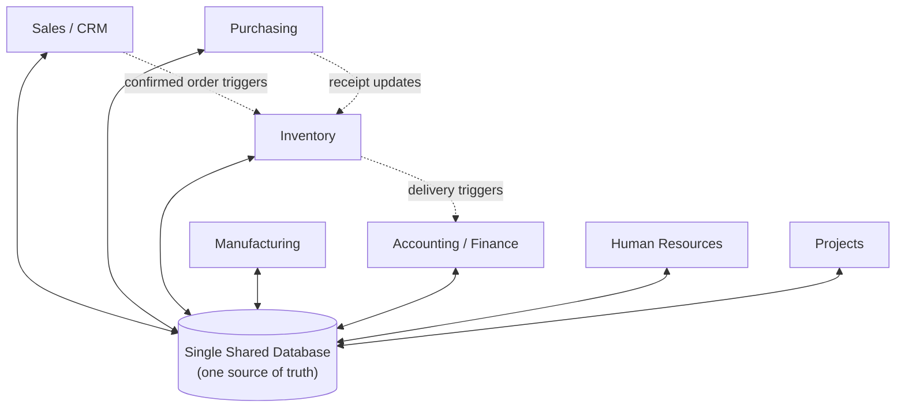
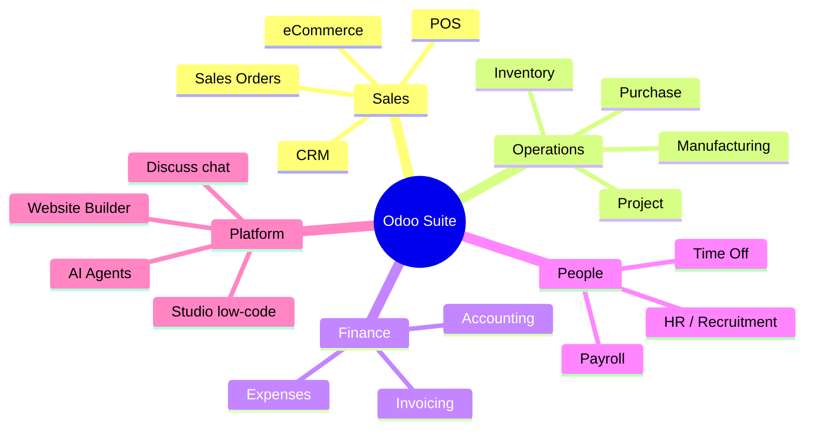
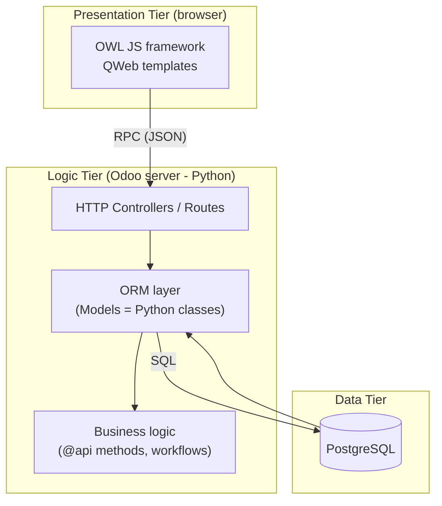
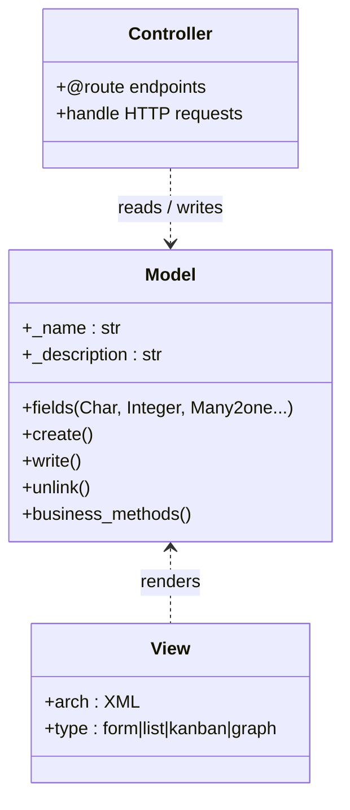
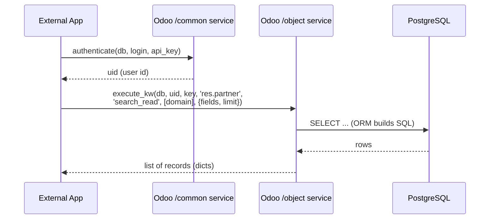
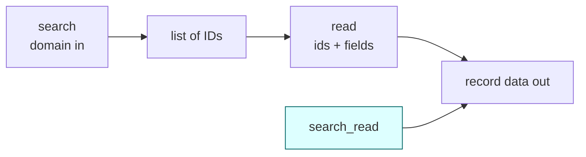
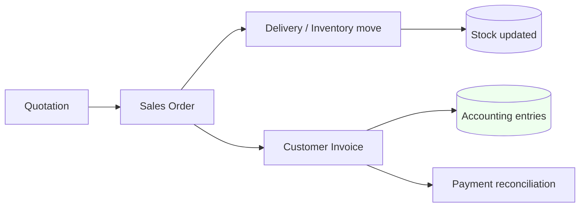

# Odoo & ERP Systems — A Developer's Study Guide

> Prepared as interview homework. Covers: what an ERP is, what Odoo is,
> its features/modules, its technical architecture, and **how you as a
> developer work with its API**. Diagrams use **Mermaid** (renders on
> GitHub, GitLab, VS Code, Obsidian, etc.).

---

## Table of Contents
1. [What is an ERP system?](#1-what-is-an-erp-system)
2. [What is Odoo?](#2-what-is-odoo)
3. [Odoo editions: Community vs Enterprise](#3-odoo-editions-community-vs-enterprise)
4. [Odoo's main features & modules](#4-odoos-main-features--modules)
5. [Technical architecture (how Odoo is built)](#5-technical-architecture-how-odoo-is-built)
6. [How a developer works with Odoo — the API](#6-how-a-developer-works-with-odoo--the-api)
7. [The ORM methods you will actually use](#7-the-orm-methods-you-will-actually-use)
8. [Building your own module (extending Odoo)](#8-building-your-own-module-extending-odoo)
9. [How Odoo serves the ERP need](#9-how-odoo-serves-the-erp-need)
10. [Quick interview cheat-sheet](#10-quick-interview-cheat-sheet)

---

## 1. What is an ERP system?

**ERP** stands for **Enterprise Resource Planning**. It is a category of
software that **unifies all of a company's core business processes into a
single shared database and a single application suite**.

Instead of running sales in one tool, accounting in a spreadsheet,
inventory in another app, and HR in a fourth — and then manually copying
data between them — an ERP keeps everything in **one source of truth**.

### Why companies need an ERP

| Problem without ERP | What an ERP fixes |
|---|---|
| Data scattered across tools that don't talk to each other | One central database; every module reads/writes the same data |
| The same record (a customer, a product) typed in many times | Enter once, reuse everywhere |
| No real-time view of the business | Live dashboards across departments |
| Manual hand-offs between teams (sale → warehouse → invoice) | Automated workflows that trigger the next step |
| Hard to enforce rules and permissions | Centralized access control and audit trail |

### The classic ERP "pillars"
A typical ERP covers: **Finance/Accounting, Sales (CRM), Purchasing,
Inventory/Warehouse, Manufacturing, Human Resources, and Project
management** — all sharing data.



> **Key idea to say in your interview:** an ERP's value is *integration*.
> A sales order automatically reserves stock, schedules a delivery, and
> generates an invoice — because all modules share one data model.

---

## 2. What is Odoo?

**Odoo** is one of the world's most popular **open-source ERP and business
management suites**. It is a single platform made of **modular apps** that
you switch on as you need them (CRM, Accounting, Inventory, Website,
eCommerce, HR, Manufacturing, Point of Sale, and many more).

A short history worth knowing:
- Created by **Fabien Pinckaers** in Belgium.
- Originally named **TinyERP**, then **OpenERP**, and rebranded to
  **Odoo** in 2014 (because it grew beyond just ERP into website, eCommerce,
  POS, etc.).
- Released on an **annual major-version cycle**, with **three releases per
  year** (one major + minor refinements).

**Version status (as of mid-2026):**
- **Odoo 19** is the current major version, unveiled at Odoo Experience 2025
  in Brussels (October 2025).
- **Odoo 19.3** (May 2026) is the latest minor release — it added
  **AI "agents"** that can create and update records from natural-language
  prompts (even reading an uploaded PDF), offline-first mobile support, a
  redesigned Manufacturing Kanban, and eCommerce/accounting improvements.
- **Odoo 20** is expected around **September 2026** (Odoo Experience 2026),
  with the headline theme being a **platform-wide AI assistance layer**
  spanning all modules rather than isolated features.

> Because versions move fast, always check the official docs for the exact
> version you'll be working on: `odoo.com/documentation/<version>/`.

---

## 3. Odoo editions: Community vs Enterprise

Odoo ships in two editions. Knowing the difference is a common interview
question.

| | **Community** | **Enterprise** |
|---|---|---|
| **License** | Open source (LGPLv3) | Proprietary, subscription-based |
| **Cost** | Free | Paid per user / per app |
| **Source code** | Fully open | Open core + closed enterprise modules |
| **Apps included** | Core apps (CRM, Sales, Inventory, basic Accounting/Invoicing, Project, etc.) | Everything in Community **plus** advanced apps (full Accounting, Studio, advanced Manufacturing/MRP, marketing automation, etc.) |
| **Hosting** | Self-host yourself | Self-host, Odoo.sh (PaaS), or Odoo Online (SaaS) |
| **Support & upgrades** | Community-driven | Official support + assisted version upgrades |

There are also **hosting/pricing tiers** for Enterprise: *One App Free*,
*Standard*, and *Custom*. **Important for developers:** the **external API
is only available on the Custom plan** — the One App Free and Standard SaaS
plans do **not** expose the external API.

---

## 4. Odoo's main features & modules

Odoo's defining feature is that it is **modular**: each "app" is really a
module that plugs into the same core. Below are the modules you'll mention.

**Operations & supply chain**
- **Inventory** — multi-warehouse stock, lots/serials, routes, barcode.
- **Manufacturing (MRP)** — bills of materials, work orders, work centers.
- **Purchase** — vendor management, RFQs, purchase orders.
- **Sales** — quotations, sales orders, pricelists.

**Customer-facing**
- **CRM** — leads, opportunities, pipeline (Kanban).
- **Website / eCommerce** — drag-and-drop site builder + online shop.
- **Point of Sale (POS)** — retail/restaurant, works offline.
- **Marketing** — email, SMS, automation, events.

**Back office**
- **Accounting / Invoicing** — full double-entry, bank sync,
  tax localizations for dozens of countries, e-invoicing.
- **Human Resources** — recruitment, employees, time-off, payroll, expenses.
- **Project** — tasks, timesheets, Gantt/Kanban planning.

**Platform-level features**
- **Studio** — low-code customization (build fields/views/apps without code).
- **Discuss** — built-in chat/messaging across the system.
- **AI agents (19.3+)** — natural-language record creation/updates,
  document reading, content generation.
- **50+ industry packages (Odoo 19)** — pre-configured setups for law firms,
  real estate, clinics, etc.
- **ESG reporting (Odoo 19)** — environmental/social/governance metrics.



---

## 5. Technical architecture (how Odoo is built)

Odoo follows a classic **three-tier architecture**. This is exactly the kind
of thing an interviewer wants you to draw.

- **Presentation tier** — the web client. Built with **OWL** (Odoo's own
  JavaScript framework) and **QWeb** templates. This is what users see in
  the browser.
- **Logic tier** — the **Odoo server**, written in **Python**. The heart of
  it is the **ORM** (Object-Relational Mapping) layer. Business logic lives
  in **models** (Python classes), and screens are defined in **views** (XML).
- **Data tier** — **PostgreSQL**, the only supported database.



**The MVC-style mapping inside a module:**
- **Model** = a Python class extending `models.Model` (defines a database
  table + its fields and methods).
- **View** = XML that describes how to render that model (form, list/tree,
  kanban, calendar, graph, pivot…).
- **Controller** = Python that handles web routes/HTTP endpoints.



---

## 6. How a developer works with Odoo — the API

There are **two worlds** of Odoo development. Be clear about which one an
interview question is asking about.

### A) Internal development (building modules *inside* Odoo)
You write Python models and XML views that run **inside** the Odoo server.
You call the ORM directly (e.g. `self.env['res.partner'].create({...})`).
This is the "real" way to extend Odoo. (See [Section 8](#8-building-your-own-module-extending-odoo).)

### B) External API (integrating Odoo *from the outside*)
Your external program (a mobile app, another website, a microservice, a
sync job) talks to Odoo over the network. Odoo exposes **the same ORM
methods** over several transport protocols:

| Protocol | Endpoint(s) | Best for | Notes |
|---|---|---|---|
| **XML-RPC** | `/xmlrpc/2/...` | Legacy / Python stdlib only | Most tutorials use it; verbose XML payloads |
| **JSON-RPC** | `/jsonrpc` | Modern apps, JS/TS | What the web client uses; payloads ~40–60% smaller |
| **JSON-2** (new) | `/web/...` JSON | The forward-looking replacement | Introduced as successor in recent versions |
| **REST** (17+) | standard HTTP verbs | Teams used to REST/OpenAPI | Newer, more limited, still maturing |

> **Deprecation note:** the classic `/xmlrpc`, `/xmlrpc/2` and `/jsonrpc`
> endpoints are scheduled for removal in **Odoo 22 (fall 2028)** (and earlier
> on Odoo Online), with the **External JSON-2 API** as the replacement. For
> brand-new integrations, prefer JSON-2 / JSON-RPC.

**Crucial:** all protocols sit on top of the **same ORM**, so the available
operations are identical — only the wire format differs.

### The external API request flow

Every external call has the same shape: **authenticate once to get a user
id, then call `execute_kw(db, uid, password, model, method, args, kwargs)`.**



### Authentication & API keys
- Calls are **stateless**: you send `db`, `uid`, and a secret on **every**
  request.
- Best practice is to use an **API key** (generated per user in
  *Preferences → Account Security*) instead of the raw password. On Odoo
  Online, an API key is required because there's no local password.
- Always use **HTTPS** and give the integration user **least-privilege**
  access (only the models/fields it needs).

### Minimal example — XML-RPC (Python, stdlib only)

```python
import xmlrpc.client

url   = "https://mycompany.odoo.com"
db    = "mycompany"
user  = "admin@example.com"
key   = "YOUR_API_KEY"          # API key, not the password

# 1) Authenticate -> get a uid
common = xmlrpc.client.ServerProxy(f"{url}/xmlrpc/2/common")
uid = common.authenticate(db, user, key, {})

# 2) Get a proxy to the object (model) service
models = xmlrpc.client.ServerProxy(f"{url}/xmlrpc/2/object")

# 3) Read customers (res.partner) that are companies
partners = models.execute_kw(
    db, uid, key,
    'res.partner', 'search_read',
    [[['is_company', '=', True]]],          # domain (the WHERE clause)
    {'fields': ['name', 'email'], 'limit': 5}
)
print(partners)
```

### Minimal example — JSON-RPC (JavaScript / fetch)

```javascript
async function callOdoo(model, method, args, kwargs = {}) {
  const res = await fetch("https://mycompany.odoo.com/jsonrpc", {
    method: "POST",
    headers: { "Content-Type": "application/json" },
    body: JSON.stringify({
      jsonrpc: "2.0",
      method: "call",
      params: {
        service: "object",
        method: "execute_kw",
        args: ["mycompany", UID, "YOUR_API_KEY", model, method, args, kwargs],
      },
      id: Date.now(),
    }),
  });
  const data = await res.json();
  if (data.error) throw new Error(JSON.stringify(data.error));
  return data.result;
}

// Read 5 company contacts
const partners = await callOdoo(
  "res.partner", "search_read",
  [[["is_company", "=", true]]],
  { fields: ["name", "email"], limit: 5 }
);
```

### Practical integration tips (good to mention)
- **Pagination for big exports:** use `search_read` with `offset` + `limit`
  (batches of ~500–1000 records) for 100k+ rows.
- **Rate limiting:** Odoo doesn't rate-limit at the app level; you enforce it
  at the reverse proxy (e.g. Nginx ~60 req/min/IP).
- **Error handling:** wrap calls — failures happen from network, permission,
  or validation errors; the response carries an `error` object.
- **Discoverability:** recent versions expose a `/doc` endpoint that
  generates live docs of the models, fields, and methods for your database.

---

## 7. The ORM methods you will actually use

These are the same whether you call them internally (`self.env[model].method`)
or externally (`execute_kw(... 'method' ...)`). This table alone answers most
"how do you use the API" questions.

| Method | What it does | Think of it as |
|---|---|---|
| `search(domain)` | Returns record **IDs** matching a domain | SQL `SELECT id WHERE` |
| `read(ids, fields)` | Returns field **values** for given IDs | `SELECT fields WHERE id IN` |
| `search_read(domain, fields)` | Search **and** read in one call | the everyday workhorse |
| `search_count(domain)` | Count matches | `SELECT COUNT(*)` |
| `create(values)` | Insert a new record | `INSERT` |
| `write(ids, values)` | Update existing records | `UPDATE` |
| `unlink(ids)` | Delete records | `DELETE` |
| `fields_get()` | Introspect a model's fields/types | schema discovery |
| `name_search(name)` | Fuzzy lookup by display name | autocomplete |

**The "domain" filter** is Odoo's query language — a list of triples
`[field, operator, value]`, e.g.:

```python
# customers in Belgium whose name starts with "A"
domain = [
    ['country_id.code', '=', 'BE'],
    ['name', '=like', 'A%'],
]
# Logical operators are prefix: '&' (and, default), '|' (or), '!' (not)
domain = ['|', ['email', '!=', False], ['phone', '!=', False]]
```



---

## 8. Building your own module (extending Odoo)

When you develop *inside* Odoo, you don't call the network API — you write a
**module**: a folder Odoo loads on startup.

**Typical module layout:**

```
my_module/
├── __init__.py            # imports the models package
├── __manifest__.py        # metadata: name, version, depends, data files
├── models/
│   └── my_model.py        # Python: the data model + logic
├── views/
│   └── my_model_views.xml # XML: forms, lists, menus, actions
└── security/
    └── ir.model.access.csv# access rights (who can read/write)
```

**A tiny model (Python):**

```python
from odoo import models, fields, api

class Course(models.Model):
    _name = "school.course"            # becomes table school_course
    _description = "Training Course"

    name = fields.Char(required=True)
    seats = fields.Integer(default=20)
    instructor_id = fields.Many2one("res.partner", string="Instructor")
    seats_taken = fields.Integer(compute="_compute_taken")

    @api.depends("instructor_id")
    def _compute_taken(self):
        for course in self:
            course.seats_taken = 0   # real logic would count attendees
```

**The four field-relationship types to know:**
- `Many2one` — link to one other record (e.g. course → instructor).
- `One2many` — the reverse: one record has many children.
- `Many2many` — many-to-many (e.g. courses ↔ tags).
- `Char/Integer/Float/Boolean/Date/Selection/Text/Binary` — scalar fields.

> Interview phrasing: *"I extend Odoo by writing modules — Python models for
> data + logic, XML views for the UI, and a manifest that declares
> dependencies. Existing models can be extended via inheritance
> (`_inherit`) without touching core code."*

---

## 9. How Odoo serves the ERP need

Tying it back to Section 1 — **why Odoo is a good ERP**:

- **True integration.** Because every app shares one PostgreSQL database
  through one ORM, a sales order can automatically reserve inventory,
  schedule a delivery, and create an invoice. No copy-paste between systems.
- **Modular adoption.** Companies start with one or two apps and switch on
  more as they grow — they don't pay for or deploy the whole suite at once.
- **Open source + extensible.** The Community edition is free and the code is
  open, so developers can read it, extend it, and build custom modules. A huge
  community App Store adds thousands of third-party modules.
- **Full stack in one place.** Unlike many ERPs that stop at back-office,
  Odoo also ships Website, eCommerce, and POS — so the same product can run an
  online store, a physical till, and the accounting behind both.
- **Open API for integration.** XML-RPC/JSON-RPC/JSON-2/REST let it sit inside
  a larger system landscape (sync with a marketplace, a CRM, a BI tool…).
- **Localization & compliance.** Built-in tax/e-invoicing localizations for
  many countries, updated every release.



> One confirmed sale → stock, logistics, and finance all update
> automatically. **That chain reaction is the whole point of an ERP**, and
> Odoo delivers it on an open, modular, developer-friendly platform.

---

## 10. Quick interview cheat-sheet

- **ERP** = one shared database + integrated apps = one source of truth.
- **Odoo** = open-source, modular ERP suite (Python + PostgreSQL + OWL/QWeb).
- **Editions:** Community (free, open) vs Enterprise (paid, more apps + support).
- **Current version:** Odoo 19 (Oct 2025); 19.3 latest (May 2026); Odoo 20 ~Sept 2026.
- **Architecture:** 3-tier — OWL client / Python ORM server / PostgreSQL.
- **Internal dev** = write modules (models in Python, views in XML, manifest).
- **External API** = XML-RPC / JSON-RPC / JSON-2 / REST, all on the same ORM.
- **Pattern:** `authenticate()` → get `uid` → `execute_kw(db, uid, key, model, method, args, kw)`.
- **Core ORM methods:** `search`, `read`, `search_read`, `create`, `write`, `unlink`, `fields_get`.
- **Domain** = list of `[field, operator, value]` triples = Odoo's WHERE clause.
- **Auth:** use **API keys** over **HTTPS**, least-privilege users.
- **External API requires the Custom plan** (not One App Free / Standard).
