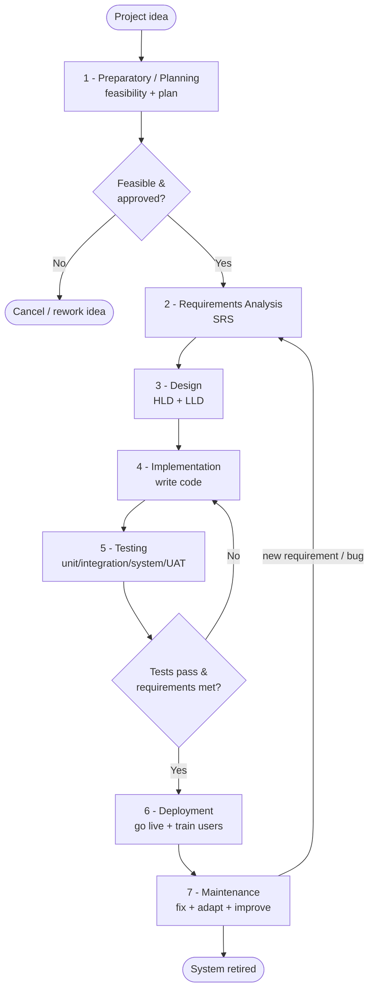
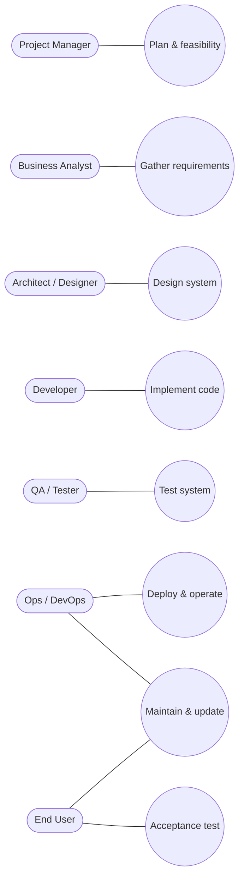
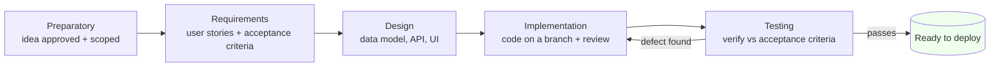
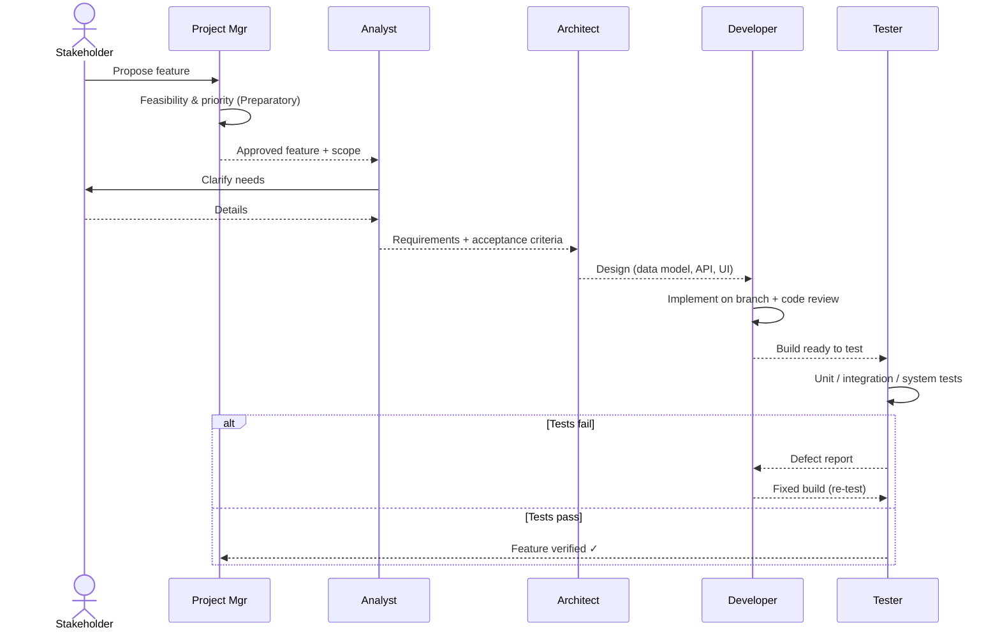
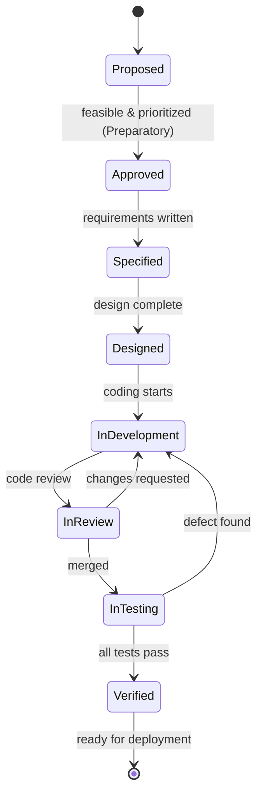
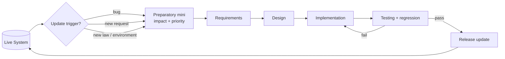
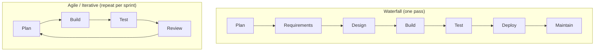

# The Systems Development Life Cycle (SDLC)
### From the Preparatory Stage to Maintenance — with UML diagrams

> Interview-homework study guide. Walks through **every stage** of the
> systems life cycle, then zooms in on **how a feature is built from the
> Preparatory stage through Testing**, and finally how the **Updating /
> Maintenance** stage feeds back into the cycle.
> Diagrams use **Mermaid UML** (activity, use-case, sequence, state, class).

---

## Table of Contents
1. [What is the SDLC?](#1-what-is-the-sdlc)
2. [The seven stages at a glance](#2-the-seven-stages-at-a-glance)
3. [Stage-by-stage in detail](#3-stage-by-stage-in-detail)
4. [UML — Activity diagram of the whole life cycle](#4-uml--activity-diagram-of-the-whole-life-cycle)
5. [UML — Use-case view of who does what](#5-uml--use-case-view-of-who-does-what)
6. [How a feature is built: Preparatory → Testing](#6-how-a-feature-is-built-preparatory--testing)
7. [UML — Sequence diagram of building a feature](#7-uml--sequence-diagram-of-building-a-feature)
8. [UML — State diagram of a feature's life](#8-uml--state-diagram-of-a-features-life)
9. [The Updating / Maintenance stage](#9-the-updating--maintenance-stage)
10. [Process models (Waterfall vs Iterative/Agile)](#10-process-models-waterfall-vs-iterativeagile)
11. [Quick cheat-sheet](#11-quick-cheat-sheet)

---

## 1. What is the SDLC?

The **Systems Development Life Cycle (SDLC)** is the structured process teams
follow to **plan, build, deliver, and maintain** an information system. It
breaks a big, risky undertaking into **ordered stages**, each with its own
inputs, activities, and outputs (deliverables), so that work is predictable,
reviewable, and high-quality.

**Why it matters:** mistakes are cheap to fix early (in planning/design) and
very expensive to fix late (after deployment). The SDLC front-loads thinking
so the build is smooth and the result actually solves the real problem.

---

## 2. The seven stages at a glance

| # | Stage | Core question it answers | Main deliverable |
|---|---|---|---|
| 1 | **Preparatory / Planning** | *Should we build this, and is it feasible?* | Project plan + feasibility study |
| 2 | **Requirements Analysis** | *What exactly must the system do?* | Requirements specification (SRS) |
| 3 | **Design** | *How will we build it?* | Architecture & detailed design docs |
| 4 | **Implementation / Development** | *Build it.* | Working source code |
| 5 | **Testing** | *Does it work and meet requirements?* | Tested, defect-free build + test reports |
| 6 | **Deployment** | *Put it into real use.* | Live system in production |
| 7 | **Maintenance** | *Keep it working & improve it.* | Patches, updates, enhancements |

> Some textbooks merge or split stages (e.g. 5, 6, or 8 phases). The
> **Preparatory → Maintenance** span your homework asks about is the full
> arc above.

---

## 3. Stage-by-stage in detail

### Stage 1 — Preparatory / Planning
The starting point. The team decides **whether the project is worth doing**
and sets it up for success.
- **Activities:** define the problem & objectives; scope the project;
  estimate cost, time, and resources; assess risks; run a **feasibility
  study** (technical, economic, operational, legal/schedule).
- **Output:** an approved **project plan** and a go / no-go decision.
- **Why first:** stops the team from building the wrong thing or a thing the
  organization can't afford or support.

### Stage 2 — Requirements Analysis
Discover and document **what the system must do**.
- **Activities:** interview stakeholders and users; gather **functional**
  requirements (features/behaviour) and **non-functional** requirements
  (performance, security, usability); resolve conflicts; prioritize.
- **Output:** a **Software/System Requirements Specification (SRS)** — the
  contract for what "done" means.
- **Tip:** good requirements are clear, testable, and traceable.

### Stage 3 — Design
Turn the *what* into a *how*.
- **Activities:** define the **system architecture** (components, data flow,
  technology stack); design the **database schema**, the **interfaces/APIs**,
  and the **UI/UX**; produce models/diagrams (class, sequence, ER diagrams).
- **Output:** **High-Level Design (HLD)** and **Low-Level Design (LLD)**
  documents that developers can build from.

### Stage 4 — Implementation / Development
The actual **coding** stage.
- **Activities:** developers write code against the design, following coding
  standards; use **version control**; integrate components; do peer **code
  reviews**.
- **Output:** the working **source code** / build.

### Stage 5 — Testing
Verify the build is correct and meets the requirements from Stage 2.
- **Levels of testing:**
  - **Unit testing** — individual functions/components.
  - **Integration testing** — components working together.
  - **System testing** — the whole system end-to-end.
  - **Acceptance testing (UAT)** — users confirm it meets their needs.
- **Activities:** write test cases from the requirements; run tests; log
  defects; developers fix; re-test (**regression testing**).
- **Output:** a validated, defect-free build + **test reports**.

### Stage 6 — Deployment
Release the system into the **production** (real-use) environment.
- **Activities:** install/configure on production infrastructure; **migrate
  data**; train users; choose a rollout strategy (big-bang, phased, pilot, or
  parallel run).
- **Output:** the system **live and in use**.

### Stage 7 — Maintenance
The longest stage — keep the live system **healthy and evolving**.
- **Types of maintenance:**
  - **Corrective** — fix bugs found in production.
  - **Adaptive** — adjust to new environments (OS, hardware, regulations).
  - **Perfective** — improve performance or add small enhancements.
  - **Preventive** — refactor / harden to avoid future problems.
- **Output:** patches, **updates**, and new feature releases — which loop
  back into earlier stages (see [Section 9](#9-the-updating--maintenance-stage)).

---

## 4. UML — Activity diagram of the whole life cycle

This activity diagram shows the **flow and the feedback loops**: testing can
send work back to development, and maintenance can re-open the whole cycle.

---

## 5. UML — Use-case view of who does what

A use-case-style view of the main actors and the activities they drive across
the life cycle (Mermaid has no native use-case shape, so this is modeled as an
actor → activity graph).

---

## 6. How a feature is built: Preparatory → Testing

Zooming in on a **single feature** as it travels from the Preparatory stage
to the Testing stage. Each stage hands a concrete artifact to the next — this
is the "feature pipeline."

| Stage | What happens to **the feature** | Artifact handed forward |
|---|---|---|
| **Preparatory** | The feature is proposed; its value, cost, risk, and feasibility are assessed; it's prioritized into the backlog/plan. | An **approved feature entry** (with scope & priority) |
| **Requirements** | The feature is detailed: user stories, acceptance criteria, edge cases, functional + non-functional needs. | A **clear spec / acceptance criteria** |
| **Design** | Decide *how* to build it: data model changes, API/interface, UI, how it fits the architecture. | **Design notes / diagrams** for the feature |
| **Implementation** | Developer writes the code on a branch, following the design; peer code review; merge. | **Code** implementing the feature |
| **Testing** | Validate against the acceptance criteria: unit → integration → system → (UAT). Defects go back to Implementation. | A **tested feature** ready to deploy |

**Key principle (great to state in interview):** *each stage's output is the
next stage's input, and the acceptance criteria written in the Requirements
stage are exactly what the Testing stage checks against.* That traceability is
how you prove a feature is "done."

---

## 7. UML — Sequence diagram of building a feature

Who talks to whom, in order, as a feature moves Preparatory → Testing.

---

## 8. UML — State diagram of a feature's life

The same feature seen as a **state machine** — the status it carries from the
moment it's proposed until it's verified and ready to ship.

---

## 9. The Updating / Maintenance stage

Once the system is **live**, it isn't frozen — it gets **updated**. The
Maintenance stage is where bug fixes, adaptations, and **new features** are
introduced. Crucially, **building an update re-uses the same Preparatory →
Testing pipeline** in miniature, just starting from a live system.

**How an update/feature is built during Maintenance:**
1. **Trigger** — a bug report, a user request, a new regulation, or a planned
   enhancement arrives.
2. **Preparatory (mini)** — assess impact, priority, and feasibility of the
   change; decide whether to do it now or later.
3. **Requirements** — specify exactly what should change and the acceptance
   criteria.
4. **Design** — design the change so it fits the existing architecture
   without breaking it.
5. **Implementation** — code the change on a branch.
6. **Testing** — test the change **and run regression tests** so existing
   features still work.
7. **Deploy the update** — release via a patch/version (often in
   environments: dev → staging → production).

> **The big takeaway:** the SDLC is a **loop, not a straight line**. The
> Maintenance stage continually feeds new work back into Preparatory →
> Requirements → … → Testing → Deployment, so the system keeps evolving until
> it is finally retired.

---

## 10. Process models (Waterfall vs Iterative/Agile)

The *stages* above are the same, but **how you move through them** differs by
process model — a likely follow-up question.

- **Waterfall:** do each stage fully, in order, before the next. Simple and
  well-documented, but rigid — late changes are costly.
- **Iterative / Agile:** repeat the stages in short cycles (sprints),
  delivering a small working slice each time and incorporating feedback.
  Flexible and feedback-driven, but needs discipline and active stakeholders.

---

## 11. Quick cheat-sheet

- **SDLC** = structured stages to plan → build → deliver → maintain a system.
- **Seven stages:** Preparatory → Requirements → Design → Implementation →
  Testing → Deployment → Maintenance.
- Each stage has **inputs, activities, and a deliverable**; the output of one
  feeds the next.
- **Mistakes are cheapest to fix early** — that's why planning and design
  come first.
- **Feature pipeline (Preparatory → Testing):** approved+scoped → spec +
  acceptance criteria → design → code+review → test vs criteria.
- **Acceptance criteria** written in Requirements are what **Testing** checks.
- **Testing levels:** unit → integration → system → acceptance (UAT).
- **Maintenance types:** corrective, adaptive, perfective, preventive.
- **Updating** re-runs the same mini-pipeline (incl. **regression testing**)
  on a live system, then releases a patch.
- **The SDLC is a loop:** maintenance feeds new work back to the start.
- **Process models:** Waterfall (one ordered pass) vs Agile/Iterative
  (repeat in short sprints).
