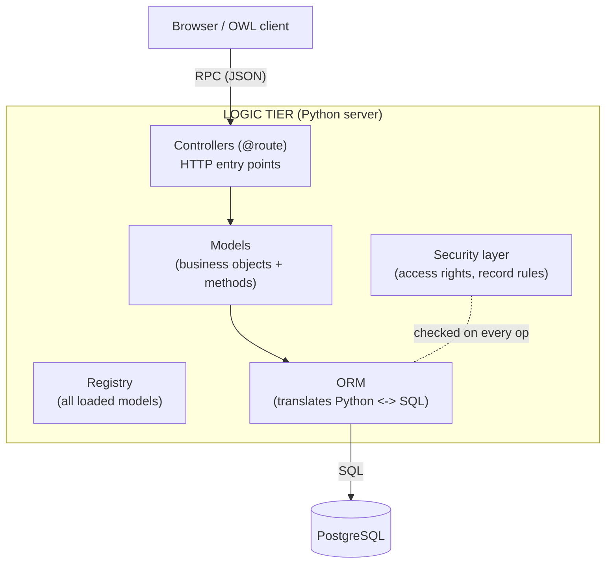
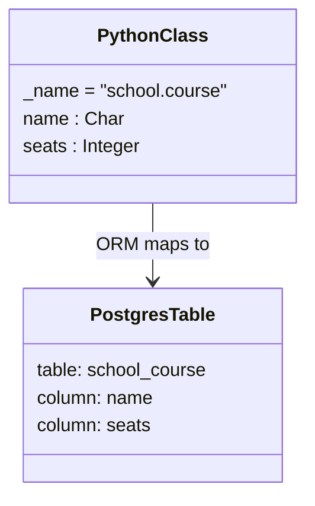
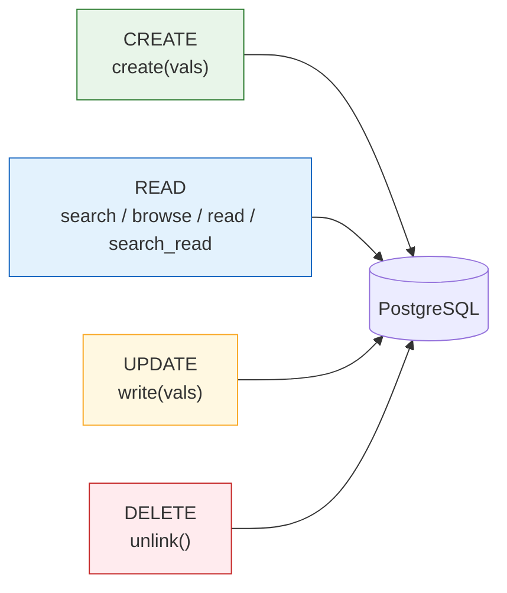
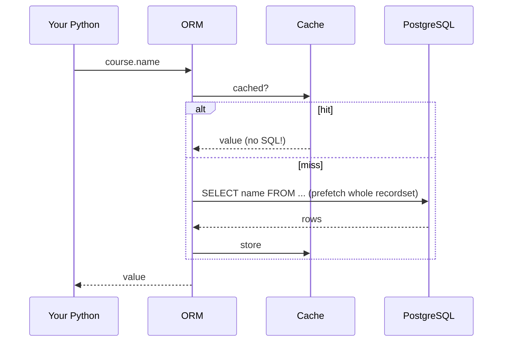

# Odoo Logic Tier — The Python / ORM Layer (Deep Dive for Python Devs)
### Featuring CRUD, recordsets, the environment, and the questions you'll be asked

> Interview prep for a **Python software developer** role. This is the tier
> you'll live in. Everything here is Python that runs **inside the Odoo
> server**, not the external network API. Examples target **Odoo 19** (the
> imports `from odoo import models, fields, api` are unchanged from earlier
> versions; v19's changes are mostly internal).

---

## Table of Contents
1. [What the Logic tier actually is](#1-what-the-logic-tier-actually-is)
2. [The ORM in one paragraph](#2-the-orm-in-one-paragraph)
3. [Models: the three base classes](#3-models-the-three-base-classes)
4. [Recordsets — the single most important concept](#4-recordsets--the-single-most-important-concept)
5. [The Environment: `self.env`, `cr`, `uid`, `context`](#5-the-environment-selfenv-cr-uid-context)
6. [Fields (scalar + relational)](#6-fields-scalar--relational)
7. [⭐ CRUD in depth](#7--crud-in-depth)
8. [Recordset operations you'll use daily](#8-recordset-operations-youll-use-daily)
9. [The `@api` decorators](#9-the-api-decorators)
10. [Computed, related, and default fields](#10-computed-related-and-default-fields)
11. [Inheritance (the Odoo way)](#11-inheritance-the-odoo-way)
12. [Constraints & validation](#12-constraints--validation)
13. [How the ORM becomes SQL (under the hood)](#13-how-the-orm-becomes-sql-under-the-hood)
14. [Controllers — the HTTP entry point](#14-controllers--the-http-entry-point)
15. [Performance gotchas](#15-performance-gotchas)
16. [Likely interview questions](#16-likely-interview-questions)

---

## 1. What the Logic tier actually is

In Odoo's three-tier architecture, the **Logic tier is the Odoo server,
written in Python.** It sits between the browser (Presentation tier) and
**PostgreSQL** (Data tier) and is where **all business logic lives**.

Its responsibilities:
- Expose **models** (Python classes) that represent business objects.
- Run the **ORM**, which translates Python operations into SQL.
- Enforce **security** (access rights + record rules) on every operation.
- Handle **HTTP requests** through controllers/routes.
- Run **workflows, computations, constraints, and automations**.



---

## 2. The ORM in one paragraph

**ORM = Object-Relational Mapping.** Each model is a Python class mapped to a
PostgreSQL **table**; each field is a **column**; each record is a **row**.
You manipulate rows by calling Python methods on **recordsets** — the ORM
writes the SQL for you, applies security, and manages a per-request cache.
**You almost never write raw SQL.** This keeps code safe (no SQL injection,
security always enforced), portable, and readable.



---

## 3. Models: the three base classes

```python
from odoo import models, fields, api

# 1) Persistent model -> a real PostgreSQL table (the usual case)
class Course(models.Model):
    _name = "school.course"
    _description = "Training Course"
    name = fields.Char(required=True)

# 2) Transient (wizard) model -> temporary rows, periodically vacuumed.
#    Used for pop-up dialogs/wizards.
class ImportWizard(models.TransientModel):
    _name = "school.import.wizard"

# 3) Abstract model -> no table; a reusable mixin to share fields/methods.
class ArchivableMixin(models.AbstractModel):
    _name = "school.archivable.mixin"
    active = fields.Boolean(default=True)
```

| Base class | Has a DB table? | Use for |
|---|---|---|
| `models.Model` | Yes (persistent) | Normal business objects |
| `models.TransientModel` | Yes, but temporary | Wizards / pop-up dialogs |
| `models.AbstractModel` | No | Mixins shared by other models |

Useful model attributes: `_name` (technical/table name), `_description`,
`_order` (default sort), `_rec_name` (which field is the display name),
`_inherit` / `_inherits` (inheritance), `_sql_constraints`.

---

## 4. Recordsets — the single most important concept

**This is the Odoo concept interviewers test most.** In Odoo, you don't work
with single objects — you work with **recordsets**: an ordered collection of
records of the **same model**. A recordset can hold zero, one, or many
records, and **`self` inside a model method is always a recordset.**

```python
def do_something(self):
    # self is a recordset -> ALWAYS loop, even if you expect one record
    for record in self:
        record.name = record.name.upper()
```

Key facts to state out loud:
- `self.env['res.partner'].search([...])` → returns a **recordset**.
- A recordset is **iterable**; iterating yields singleton recordsets (size 1).
- `len(recordset)` gives the count; `recordset.ids` gives the list of IDs.
- Accessing a field on a **multi-record** set raises an error (except
  relational fields, which return a recordset) — hence "always loop."
- Recordsets support **set operations**: `rs1 | rs2` (union),
  `rs1 & rs2` (intersection), `rs1 - rs2` (difference).
- An **empty recordset** is falsy: `if not partner:`.

```python
partners = env['res.partner'].search([('is_company', '=', True)])
len(partners)          # how many
partners.ids           # [3, 7, 12, ...]
partners[0]            # first record (a size-1 recordset)
partners.mapped('name')   # ['Acme', 'Globex', ...]
```

---

## 5. The Environment: `self.env`, `cr`, `uid`, `context`

Every recordset carries an **environment** (`self.env`) — the execution
context for the current request. It's how you reach other models and key
request data.

```python
self.env['res.partner']         # access ANY model by its _name
self.env.user                   # the current user (res.users recordset)
self.env.company                # the current company
self.env.context                # dict of contextual data (lang, tz, defaults)
self.env.cr                     # the DB cursor (raw SQL — use sparingly!)
self.env.uid                    # current user id
```

Two power tools to know:
- **`sudo()`** — returns the recordset running as superuser, **bypassing
  access-rights checks**. Powerful and dangerous: it can cross record-rule
  boundaries (e.g. mix data between companies), so use deliberately.
- **`with_context(...)`** — returns a copy of the recordset with extra
  context keys (e.g. language, default values for created records).

```python
partner.sudo().write({'credit_limit': 0})          # ignore access rights
self.with_context(lang='fr_FR').name               # read in French
```

---

## 6. Fields (scalar + relational)

```python
from odoo import models, fields

class Course(models.Model):
    _name = "school.course"

    # --- scalar fields ---
    name        = fields.Char(required=True)
    description = fields.Text()
    seats       = fields.Integer(default=20)
    price       = fields.Float(digits=(10, 2))
    active      = fields.Boolean(default=True)
    start_date  = fields.Date()
    level       = fields.Selection(
        [('beg', 'Beginner'), ('adv', 'Advanced')], default='beg')

    # --- relational fields ---
    instructor_id = fields.Many2one('res.partner', string='Instructor')
    session_ids   = fields.One2many('school.session', 'course_id')
    tag_ids       = fields.Many2many('school.tag')
```

| Field | Meaning | DB reality |
|---|---|---|
| `Many2one` | link to **one** other record | a foreign-key column |
| `One2many` | the **reverse** of a Many2one (no column) | virtual; needs the inverse field name |
| `Many2many` | many ↔ many | a hidden junction table |

> Interview nuance: a `One2many` has **no database column** — it's the mirror
> of a `Many2one` on the other model, which is why you pass the inverse field
> name (`'course_id'` above).

---

## 7. ⭐ CRUD in depth

CRUD = **Create, Read, Update, Delete**. In Odoo these map to ORM methods.
This is the section your interviewer will dig into, so know the **signatures,
return types, and gotchas.**



### C — Create

`create(vals)` inserts a row (or rows) and **returns the new recordset.**
Since Odoo 12+, `create` accepts a **list of dicts** to batch-insert.

```python
# single
course = self.env['school.course'].create({
    'name': 'Python 101',
    'seats': 30,
    'instructor_id': instructor.id,   # Many2one -> pass an ID
})

# batch (one efficient call -> recordset of 2)
courses = self.env['school.course'].create([
    {'name': 'Algorithms'},
    {'name': 'Databases'},
])
```

**Writing to x2many fields uses special command tuples** (the `Command`
helper). Know at least `set`, `create`, `link`, `unlink`, `clear`:

```python
from odoo import Command

self.env['school.course'].create({
    'name': 'DevOps',
    'tag_ids': [
        Command.create({'name': 'cloud'}),  # create + link a new tag
        Command.link(existing_tag.id),       # link an existing tag
        Command.set([t1.id, t2.id]),         # replace the whole set
    ],
})
```

### R — Read (four methods, know when to use each)

```python
Model = self.env['school.course']

# search() -> returns a RECORDSET (lazy; fields loaded on access)
courses = Model.search([('seats', '>', 10)], limit=20, order='name asc')

# search_count() -> just the number (efficient COUNT)
n = Model.search_count([('active', '=', True)])

# browse(ids) -> recordset for known IDs, NO query yet (lazy)
course = Model.browse(42)

# read(fields) -> list of dicts (use when serializing/exporting)
data = courses.read(['name', 'seats'])

# search_read() -> search + read in ONE call (the API workhorse)
rows = Model.search_read([('active', '=', True)],
                         fields=['name', 'seats'], limit=50)
```

| Method | Returns | Use when |
|---|---|---|
| `search` | recordset | you'll work with the records in Python |
| `search_count` | int | you only need a count |
| `browse` | recordset | you already have the ID(s) |
| `read` | list of dicts | you need raw values (export/JSON) |
| `search_read` | list of dicts | search + serialize in one shot |

**The domain** is Odoo's query/filter language — a list of
`(field, operator, value)` triples, with prefix logical operators
(`&` = and/default, `|` = or, `!` = not):

```python
# active companies in BE OR FR whose name starts with "A"
domain = [
    ('is_company', '=', True),
    '|', ('country_id.code', '=', 'BE'), ('country_id.code', '=', 'FR'),
    ('name', '=like', 'A%'),
]
# operators: =, !=, >, >=, <, <=, like, ilike, =like, in, not in,
#            child_of, parent_of
# dotted paths traverse relations: 'country_id.code'
```

### U — Update

`write(vals)` updates **every record in the recordset** in one SQL `UPDATE`
and returns `True`. You can also assign a field directly on a singleton.

```python
courses.write({'active': False})        # update many at once
course.seats = 40                       # direct assign on a singleton

# updating x2many with Command tuples
course.write({'tag_ids': [Command.unlink(old_tag.id)]})
```

> Gotcha: directly assigning `record.field = x` only works on a **singleton**
> recordset; for multi-record sets use `write()` or loop.

### D — Delete

`unlink()` deletes every record in the recordset (SQL `DELETE`) and returns
`True`. It respects foreign-key constraints and `ondelete` rules.

```python
courses.unlink()
```

**Bonus you may be asked about:** `copy(default=None)` duplicates a record.

```python
new_course = course.copy({'name': 'Python 101 (copy)'})
```

### CRUD quick table

| Op | Method | Returns | SQL |
|---|---|---|---|
| Create | `create(vals)` / `create([vals,...])` | new recordset | `INSERT` |
| Read | `search` / `browse` / `read` / `search_read` | recordset or dicts | `SELECT` |
| Update | `write(vals)` | `True` | `UPDATE` |
| Delete | `unlink()` | `True` | `DELETE` |

---

## 8. Recordset operations you'll use daily

These let you avoid manual loops and extra queries — interviewers love seeing
idiomatic Odoo here.

```python
# mapped() -> pull a field (or traverse relations) into a list/recordset
emails   = partners.mapped('email')             # ['a@x.com', ...]
countries = partners.mapped('country_id')       # a recordset (deduped)

# filtered() -> keep records matching a Python predicate (no DB hit)
companies = partners.filtered(lambda p: p.is_company)
companies = partners.filtered('is_company')      # shorthand for truthy field

# sorted() -> sort a recordset in Python
ordered = courses.sorted(key=lambda c: c.seats, reverse=True)

# set ops
both = rs_a & rs_b
```

> Rule of thumb: **search once, then `filtered`/`mapped` in Python** instead
> of running `search` inside a loop.

---

## 9. The `@api` decorators

```python
from odoo import api, models, fields

class Course(models.Model):
    _name = "school.course"
    name = fields.Char()
    seats = fields.Integer()
    seats_taken = fields.Integer(compute="_compute_taken", store=True)

    # recordset-independent (no records needed to call it) -> e.g. defaults
    @api.model
    def _default_seats(self):
        return 20

    # recompute when a dependency changes (computed fields)
    @api.depends('session_ids', 'session_ids.attendee_ids')
    def _compute_taken(self):
        for course in self:
            course.seats_taken = len(course.session_ids.attendee_ids)

    # UI helper: update fields live in the form BEFORE saving (not persisted)
    @api.onchange('seats')
    def _onchange_seats(self):
        if self.seats < 0:
            self.seats = 0

    # data integrity check at save time -> raise to block the write
    @api.constrains('seats')
    def _check_seats(self):
        for course in self:
            if course.seats < 0:
                raise models.ValidationError("Seats cannot be negative.")
```

| Decorator | When it runs | Typical use |
|---|---|---|
| `@api.model` | method doesn't need existing records | defaults, class-level helpers |
| `@api.depends` | dependency field changes | **computed** fields |
| `@api.onchange` | a field changes in the **form UI** | live UI updates (not saved) |
| `@api.constrains` | on create/write | **Python validation** |

> Key distinction interviewers probe: **`onchange` is UI-only and not
> persisted**, while **`constrains` runs on the server at save time and can
> block the operation.**

---

## 10. Computed, related, and default fields

```python
# computed: value derived by a method; store=True to persist & make searchable
total = fields.Float(compute="_compute_total", store=True)

# related: shortcut to a field on a linked record
country_code = fields.Char(related="instructor_id.country_id.code")

# defaults: static or callable
seats  = fields.Integer(default=20)
date   = fields.Date(default=fields.Date.today)
ref    = fields.Char(default=lambda self: self._default_seats())
```

- A **computed** field without `store=True` is calculated on the fly (not in
  the DB, not searchable unless you add a `search=` method).
- A **related** field is a convenience proxy to a field across a relation.

---

## 11. Inheritance (the Odoo way)

Three inheritance mechanisms — a classic interview question.

```python
# 1) CLASSICAL / EXTENSION: same _name -> add fields/methods to an EXISTING
#    model (this is how you extend res.partner, sale.order, etc.)
class PartnerExt(models.Model):
    _inherit = "res.partner"
    loyalty_points = fields.Integer(default=0)

# 2) PROTOTYPE: _inherit + a NEW _name -> copy a model into a new one
class SpecialPartner(models.Model):
    _name = "school.special.partner"
    _inherit = "res.partner"        # reuses behaviour under a new model

# 3) DELEGATION (_inherits): embed another model by reference (composition)
class Teacher(models.Model):
    _name = "school.teacher"
    _inherits = {"res.partner": "partner_id"}   # gets partner's fields
    partner_id = fields.Many2one("res.partner", required=True, ondelete="cascade")
```

| Mechanism | Syntax | Effect |
|---|---|---|
| Extension | `_inherit = 'model'` | **modify** the existing model in place |
| Prototype | `_inherit` + new `_name` | **copy** fields/logic into a new model |
| Delegation | `_inherits = {'model': 'fk'}` | **compose**: expose another model's fields via a FK |

To **extend a method**, override it and call `super()`:

```python
class PartnerExt(models.Model):
    _inherit = "res.partner"

    @api.model_create_multi
    def create(self, vals_list):
        records = super().create(vals_list)   # keep core behaviour
        records.loyalty_points = 10            # add yours
        return records
```

> Note: when overriding `create`, the modern signature is
> `@api.model_create_multi def create(self, vals_list)` (a list of dicts),
> matching batch creation.

---

## 12. Constraints & validation

Two layers — know both:

```python
class Course(models.Model):
    _name = "school.course"

    # 1) SQL constraint -> enforced by PostgreSQL (fast, DB-level)
    _sql_constraints = [
        ('name_uniq', 'unique(name)', 'Course name must be unique!'),
        ('seats_positive', 'CHECK(seats >= 0)', 'Seats must be >= 0.'),
    ]

    # 2) Python constraint -> for logic SQL can't express
    @api.constrains('seats', 'session_ids')
    def _check_capacity(self):
        for c in self:
            if c.seats and len(c.session_ids) > c.seats:
                raise models.ValidationError("Too many sessions for seats.")
```

| Layer | Where it runs | Use for |
|---|---|---|
| `_sql_constraints` | PostgreSQL | uniqueness, simple CHECKs (fast) |
| `@api.constrains` | Python server | complex/cross-field business rules |

---

## 13. How the ORM becomes SQL (under the hood)

What to say when asked "what happens when I read a field?":

1. You call a method on a recordset (e.g. access `course.name`).
2. The ORM checks its **per-request cache** first. If present, **no SQL runs**.
3. If not cached, the ORM **prefetches**: it reads that field for the *whole*
   recordset at once (not row-by-row) and caches the results — a big
   performance win.
4. Security (**access rights** + **record rules**) is applied; the ORM builds
   and runs parameterized SQL on PostgreSQL via the cursor (`env.cr`).
5. Results populate the cache and are returned as Python values/recordsets.



You *can* drop to raw SQL via `self.env.cr.execute(...)`, but it **bypasses
the ORM cache and all security**, so it's reserved for complex joins or
performance-critical reads — and you must sanitize inputs yourself.

---

## 14. Controllers — the HTTP entry point

Controllers handle web routes (e.g. for the website, REST-ish endpoints, or
webhooks). They live in the Logic tier too.

```python
from odoo import http
from odoo.http import request

class CourseController(http.Controller):

    @http.route('/courses', type='http', auth='public', website=True)
    def list_courses(self, **kw):
        courses = request.env['school.course'].sudo().search([])
        return request.render('school.course_list_template', {'courses': courses})

    @http.route('/api/courses', type='json', auth='user')
    def json_courses(self, **kw):
        return request.env['school.course'].search_read([], ['name', 'seats'])
```

- `type='http'` returns web pages; `type='json'` returns JSON (RPC-style).
- `auth='public'` (anyone), `'user'` (must be logged in), `'none'`.
- `request.env` gives you the ORM inside a controller.

---

## 15. Performance gotchas

Things that separate juniors from mid/seniors — great to volunteer:

- **Never `search` inside a loop.** Search once, then `filtered()`/`mapped()`.
- **Batch `create`** with a list of dicts instead of N single creates.
- **Use `search_read`** (and pagination with `limit`/`offset`) for big exports
  instead of `search` then `read`.
- **Avoid N+1 field access**; the ORM prefetches per recordset, so iterate the
  recordset rather than re-browsing individual IDs.
- **`store=True` on computed fields** makes them searchable and avoids
  recomputation, at the cost of write overhead — choose deliberately.
- **`sudo()` only when needed** — it bypasses record rules and can leak data
  across companies.
- **Raw SQL** bypasses cache + security; use it rarely and parameterize.

---

## 16. Likely interview questions

Rapid-fire answers to rehearse:

- **"What is a recordset?"** An ordered set of records of one model; `self` is
  always a recordset, so you loop even for one record.
- **"Difference between `browse` and `search`?"** `browse(ids)` builds a
  recordset from known IDs (lazy, no query); `search(domain)` queries the DB
  for matching IDs and returns a recordset.
- **"`read` vs `search_read`?"** `read` needs a recordset and returns dicts;
  `search_read` does the search and the read in one call.
- **"`onchange` vs `constrains`?"** `onchange` is UI-only, runs in the form,
  not persisted; `constrains` runs on the server at save and can block it.
- **"How do you create multiple records efficiently?"** Pass a list of dicts
  to `create()` (batch) — one call, returns a recordset.
- **"How do you update many records?"** `recordset.write(vals)` → one `UPDATE`.
- **"Types of inheritance?"** Extension (`_inherit`, same name), prototype
  (`_inherit` + new `_name`), delegation (`_inherits`, composition).
- **"How do you write to a Many2many?"** Command tuples:
  `Command.set/link/unlink/create/clear`.
- **"What is `self.env`?"** The environment — access to any model, the user,
  company, context, and the DB cursor.
- **"When raw SQL?"** Only for complex joins/perf; it bypasses cache and
  security, so parameterize and be careful.
- **"What does `sudo()` do?"** Runs as superuser, bypassing access rights —
  powerful but can cross record-rule/company boundaries.

---

### One-line summary
> The **Logic tier is Odoo's Python server**; you model business objects as
> classes, operate on **recordsets** through the **ORM**, and do **CRUD** with
> `create` / `search`(+`browse`/`read`/`search_read`) / `write` / `unlink` —
> while the ORM handles SQL, caching, and security for you.
