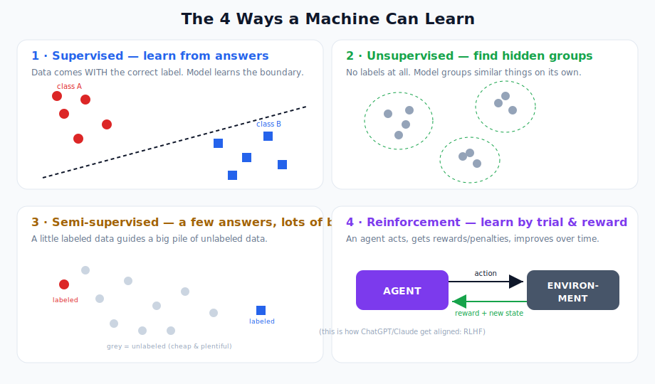
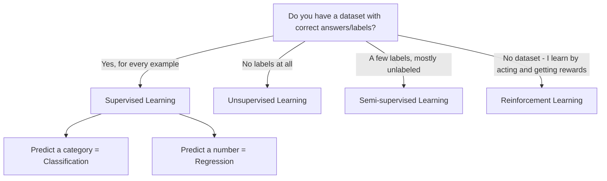
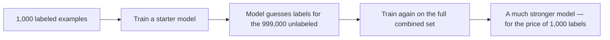
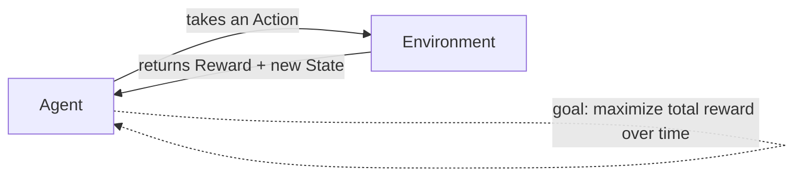
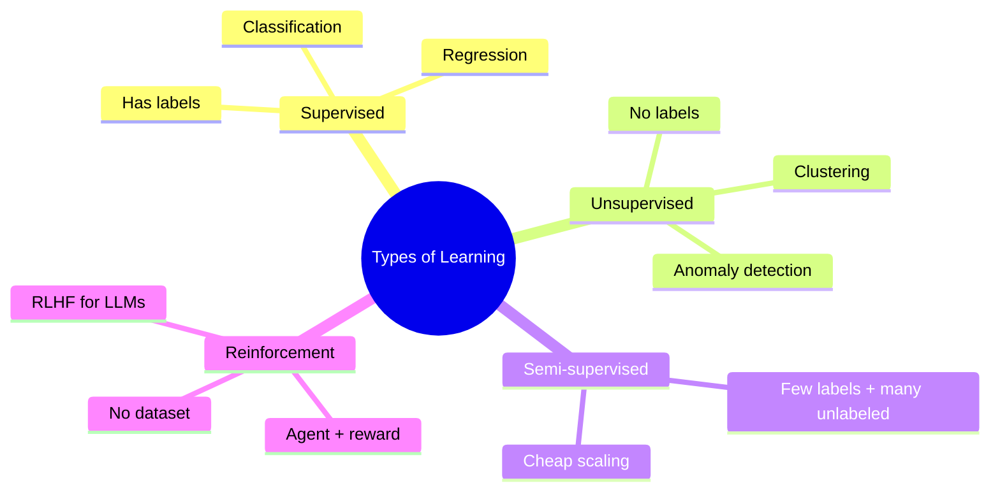

# Machine Learning: Types of Learning

> **What this file teaches you:** the four fundamental ways a computer can "learn" from data, when each one is used, and the real products built with each. By the end you'll be able to look at any AI problem and say *"that's a supervised classification problem"* or *"that's reinforcement learning."*

---

## What does "learning" even mean here?

Normal software follows rules a human wrote: `if temperature > 38 then "fever"`. **Machine Learning flips this around.** Instead of writing the rules, you show the computer thousands of *examples*, and it figures out the rules by itself.

The way it learns depends entirely on **what kind of data you give it** and **what you want it to do**. There are four main types.

A quick way to decide which type you're dealing with:

---

## 1. Supervised Learning — learning with an answer key

This is the most common type, and the easiest to understand. Every example in your training data comes **paired with the correct answer** (called a *label*).

**The mental model:** flashcards. The front has the question, the back has the answer. You study thousands of them, and eventually you can answer questions you've never seen because you learned the *underlying pattern* — not just memorized the cards.

Supervised learning splits into two jobs:

| Job | You predict... | Everyday example |
|-----|----------------|------------------|
| **Classification** | a category / label | "Is this email spam or not spam?" |
| **Regression** | a continuous number | "What price will this house sell for?" |

**The teacher analogy (from the original notes):** A student learns *with a teacher*. The teacher hands over practice problems **and** the correct answers. The student absorbs the pattern, then gets tested on new, unseen problems.

### 🌍 Real-world projects using supervised learning
- **Gmail spam filter** — classification. Trained on millions of emails humans marked "spam" or "not spam."
- **Zillow's "Zestimate"** — regression. Predicts a home's value from features like square footage, location, and number of bedrooms.
- **Credit scoring at banks** — classification. "Will this applicant default: yes/no?"
- **Medical diagnosis from X-rays** — classification. Trained on scans radiologists already labeled "tumor / no tumor."

---

## 2. Unsupervised Learning — finding hidden structure

Here there are **no labels at all**. You hand the machine a pile of data and it has to discover the structure *on its own*. Nobody tells it what's "correct."

**The mental model (from the notes):** you're handed a giant bucket of foreign coins you've never seen. Even without knowing their names or values, you can still **group them** by size, color, and shape. That grouping is unsupervised learning.

Three common jobs:

| Job | What it does | Example |
|-----|--------------|---------|
| **Clustering** | groups similar things together | Splitting customers into "budget shoppers" vs "luxury shoppers" |
| **Dimensionality Reduction** | shrinks many features into a few | Compressing 100 survey questions into 5 key traits |
| **Anomaly Detection** | flags the weird outliers | Catching a fraudulent transaction among millions of normal ones |

### 🌍 Real-world projects using unsupervised learning
- **Amazon / Netflix customer segmentation** — clustering shoppers by behavior to target recommendations.
- **Credit-card fraud detection** — anomaly detection. A purchase in another country at 3 a.m. doesn't match your pattern, so it gets flagged.
- **Spotify's "music discovery"** — clustering songs with similar audio features.
- **Topic discovery in news** — automatically grouping thousands of articles into topics nobody pre-defined.

---

## 3. Semi-supervised Learning — a few answers, lots of blanks

This sits between the first two, and it exists because of a **real-world money problem**: collecting raw data is *cheap*, but having a human expert *label* it is *expensive and slow*.

Imagine you have **1 million medical scans** but can only afford to pay radiologists to label **1,000** of them. Semi-supervised learning uses those 1,000 labeled scans to learn the basics, then makes educated guesses ("pseudo-labels") for the other 999,000, and trains on everything combined.

### 🌍 Real-world projects using semi-supervised learning
- **Google Photos face grouping** — you tag one or two faces, it labels the rest of your library.
- **Speech recognition** (Siri, Alexa) — huge amounts of unlabeled audio, small amounts hand-transcribed.
- **Web page classification** — billions of pages, only a tiny fraction hand-categorized.

---

## 4. Reinforcement Learning — learning by trial and reward

This one is fundamentally different: there's **no fixed dataset**. Instead, an **agent** interacts with an **environment**, and learns purely through **trial and error**.

**The mental model (from the notes):** training a dog. You don't give the dog a math formula for "fetch." You throw the stick. Brings it back → treat (reward). Runs off → nothing (penalty). Over time the dog learns the *strategy* that earns the most treats.

The five core pieces:

| Piece | Meaning | Dog example |
|-------|---------|-------------|
| **Agent** | the learner / decision-maker | the dog |
| **Environment** | the world it acts in | the park |
| **Action** | what it can do | run, sit, fetch |
| **State** | the current situation | "stick is 10m away" |
| **Reward** | feedback on the last action | a treat, or nothing |

### 🌍 Real-world projects using reinforcement learning
- **RLHF — how ChatGPT and Claude are made helpful.** This is the most important one for you. After an LLM learns language, humans rank its answers, and reinforcement learning tunes the model toward the answers people prefer. *(You'll see this again in the LLM training-phases module.)*
- **DeepMind's AlphaGo** — beat the world champion at Go by playing millions of games against itself.
- **Robotics** — a robot arm learns to grasp objects by trying, failing, and adjusting.
- **Self-driving cars** — learning lane-keeping and braking policies in simulation.

---

## 🧠 Putting it together

**One-line summary:** *Supervised* learns from answers, *unsupervised* finds hidden groups, *semi-supervised* stretches a few answers across lots of data, and *reinforcement* learns by acting and chasing rewards. Modern LLMs actually use **three of these** at different stages — supervised, unsupervised, and reinforcement.

➡️ **Next file:** `02_Core_Algorithms.md` — the actual algorithms that perform supervised and unsupervised learning.
