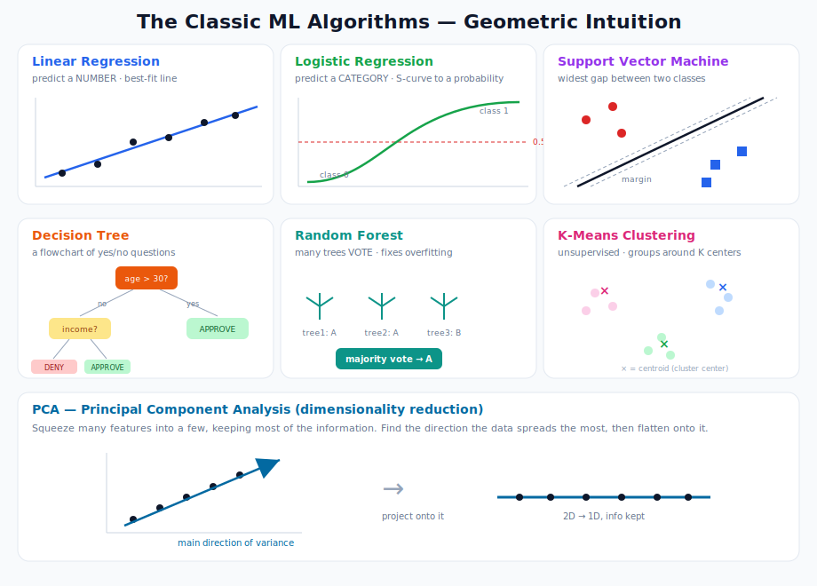
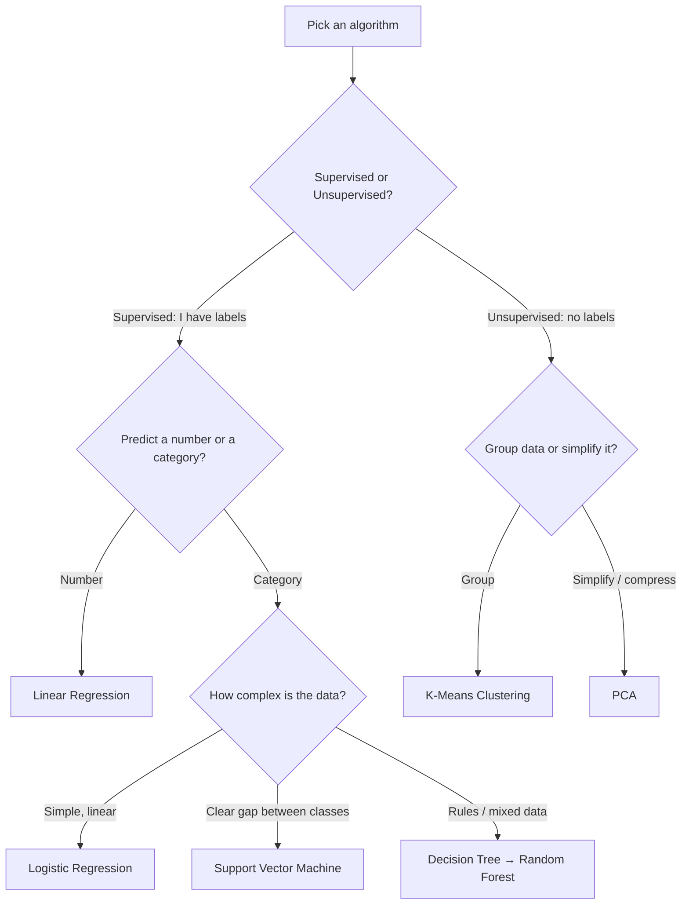
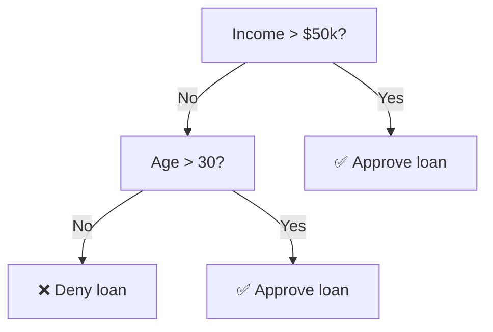
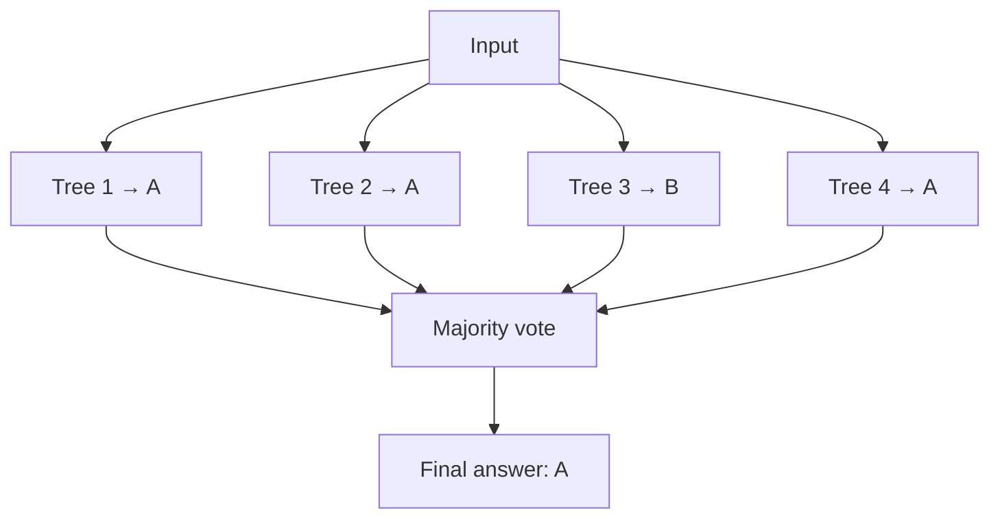
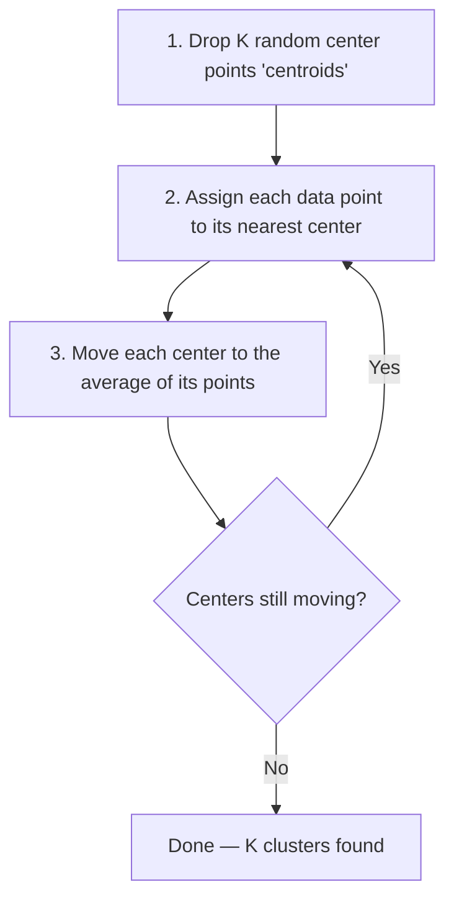

# Machine Learning: Core Algorithms

> **What this file teaches you:** the seven classic algorithms every ML engineer knows. You won't build an LLM with these, but they teach the core ideas — *fitting a line, drawing a boundary, grouping data* — that neural networks and Transformers are built on top of. Think of this as learning to walk before you run.

A simple map of which algorithm does what:

---

## 1. Linear Regression — drawing the best-fit line

**Job:** predict a *number* (regression).

It assumes a straight-line relationship between input and output and finds the line that sits closest to all your data points. The "closest" is measured by squaring the gaps between the line and each point, then minimizing the total (this is called **Mean Squared Error**).

**Formula:** `y = mx + b` — output = (slope × input) + offset. That's the same `y = mx + b` from high-school algebra.

> **Why squared?** Squaring punishes big mistakes far more than small ones, so the line really tries to avoid being wildly wrong anywhere.

### 🌍 Real-world use
- **Real estate pricing** (Zillow-style estimates from square footage + location).
- **Sales forecasting** — predicting next quarter's revenue from ad spend.
- **Demand planning** in retail and supply chains.

---

## 2. Logistic Regression — the S-curve that says yes or no

**Job:** despite the name, this does **classification**, not regression. Specifically binary (two-class) problems.

Instead of a straight line, it bends the output through an **S-shaped sigmoid curve** that always lands between 0 and 1 — a *probability*. If the probability is above 0.5 → predict class 1; below → class 0.

**Formula:** take a linear score `z = mx + b`, then squash it: `p = 1 / (1 + e^-z)`.

> 💡 **Remember this sigmoid.** The exact same curve reappears *inside* neural networks as an activation function. Logistic regression is basically a single neuron.

### 🌍 Real-world use
- **Email spam detection** (spam vs not-spam).
- **Medical screening** — "is this tumor malignant or benign?"
- **Click-through prediction** — "will this user click this ad?"

---

## 3. Decision Trees — a flowchart of yes/no questions

**Job:** classification *or* regression. Extremely easy for humans to read.

The algorithm builds a flowchart. At each step it picks the question that best splits the data into cleaner groups, branching until it reaches a final answer at the "leaves."

**The catch:** a single deep tree tends to **memorize** the training data (overfitting — see the next file). It's interpretable but fragile.

### 🌍 Real-world use
- **Loan approval** systems (transparent, auditable decisions — important for regulators).
- **Customer churn prediction** — "will this subscriber cancel?"
- **Medical triage** flowcharts.

---

## 4. Random Forest — let many trees vote

**Job:** fixes the decision tree's overfitting problem using an **ensemble** (many models combined).

Instead of one deep tree, it grows hundreds of shallower trees, each trained on a **random** slice of the data and features (hence "random forest"). To predict, all the trees **vote**, and the majority wins. Each tree is wrong in its own way, but the errors cancel out.

> **Fun fact:** On structured/tabular data (spreadsheets), random forests and their cousins (XGBoost) *still routinely beat deep neural networks*. They dominate Kaggle competitions for tabular problems.

### 🌍 Real-world use
- **Fraud detection** at banks and payment processors.
- **Kaggle tabular competitions** — the go-to baseline that's hard to beat.
- **Feature importance** analysis — finding which factors matter most.

---

## 5. Support Vector Machine (SVM) — the widest possible gap

**Job:** classification, by finding the *best* dividing boundary.

SVM doesn't just find *any* line separating two classes — it finds the one with the **widest margin** (biggest empty gap) between them. The data points sitting right on the edge of that gap are the "support vectors" that define the boundary.

**The kernel trick:** if a straight line can't separate the classes, SVM mathematically lifts the data into a higher dimension where it *can* be cleanly split — then projects the boundary back down.

### 🌍 Real-world use
- **Text classification** (e.g. sentiment analysis) before deep learning took over.
- **Image classification** on smaller datasets.
- **Bioinformatics** — classifying proteins and genes, where datasets are small but high-dimensional.

---

## 6. K-Means Clustering — grouping around centers

**Job:** unsupervised clustering. The most popular grouping algorithm.

You tell it how many groups you want (**K**). It then:

### 🌍 Real-world use
- **Customer segmentation** — grouping users by purchasing behavior for marketing.
- **Image compression** — reducing an image to K representative colors.
- **Document / news grouping** — organizing articles by topic.

---

## 7. PCA (Principal Component Analysis) — squeeze without losing much

**Job:** unsupervised **dimensionality reduction** — fewer features, most of the information kept.

When data has hundreds of features it's slow to process and impossible to visualize (the "curse of dimensionality"). PCA finds the directions along which the data **varies the most**, and flattens everything onto just a few of them. You might compress 100 features into 10 while keeping ~95% of the information.

> 🔗 **Connection to the math module:** PCA is built directly on **eigenvectors and eigenvalues** from linear algebra. The eigenvectors *are* the principal directions.

### 🌍 Real-world use
- **"Eigenfaces"** — early facial recognition compressed face images with PCA.
- **Gene expression analysis** — thousands of genes squeezed into a few meaningful patterns.
- **Data visualization** — projecting high-dimensional data down to 2D so you can plot and see it.

---

## 🧠 Cheat-sheet summary

| Algorithm | Type | One-liner |
|-----------|------|-----------|
| Linear Regression | Supervised (number) | Best-fit straight line |
| Logistic Regression | Supervised (category) | S-curve → probability |
| Decision Tree | Supervised (both) | Readable yes/no flowchart |
| Random Forest | Supervised (both) | Many trees vote |
| SVM | Supervised (category) | Widest gap between classes |
| K-Means | Unsupervised | Group around K centers |
| PCA | Unsupervised | Compress features, keep info |

**The throughline:** every one of these is about either **drawing a boundary**, **fitting a curve**, or **grouping points** — and that's exactly what a neural network does too, just with millions of tiny adjustable knobs instead of a simple formula.

➡️ **Next file:** `03_Key_Concepts.md` — the universal rules for making any of these models actually work on new data.
