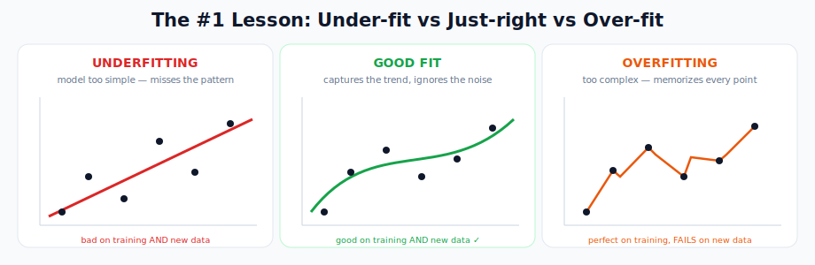
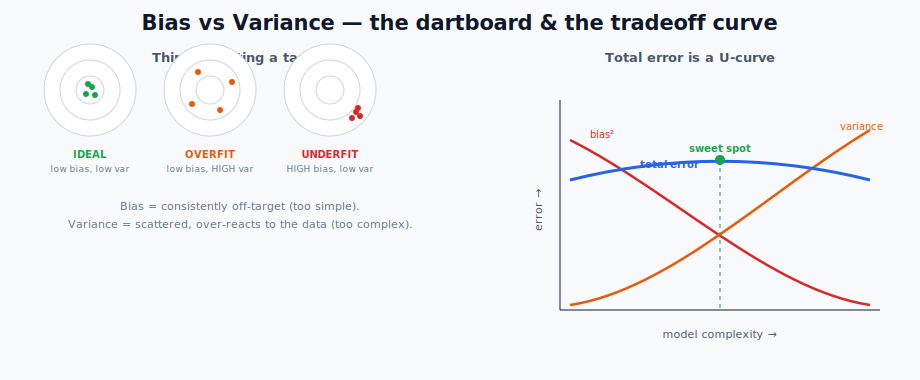
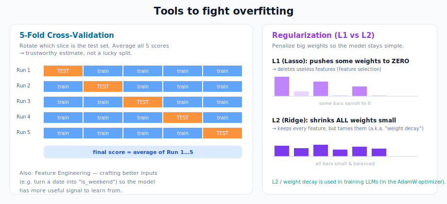
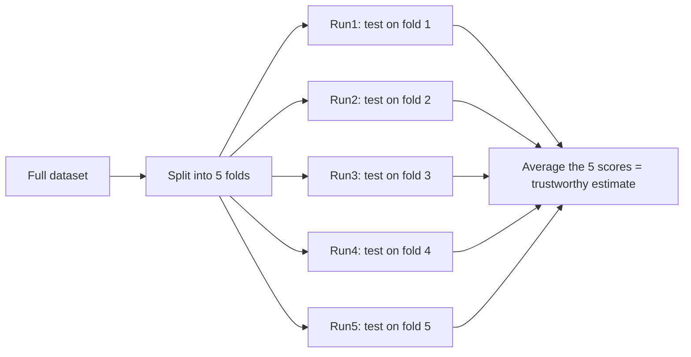
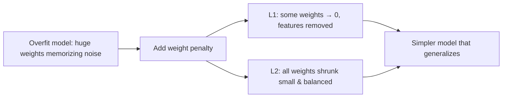
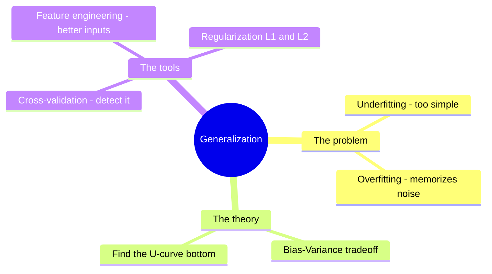

# Machine Learning: Key Concepts

> **What this file teaches you:** the universal rules that decide whether *any* model — from a simple decision tree to a billion-parameter LLM — actually works on data it has never seen. If you only deeply learn one file in this whole module, make it this one. These ideas never stop mattering.

The single goal behind everything here is **generalization**: performing well on **new, unseen data**, not just the data you trained on. A model that aces its training data but fails in the real world is useless.

---

## 1. Overfitting vs Underfitting — the central tension

- **Underfitting** — the model is **too simple** to capture the real pattern. Like drawing a straight line through clearly curved data. It does badly on *both* the training data and new data.
- **Overfitting** — the model is **too complex** and **memorizes** the training data, *including the random noise*. It looks perfect on training data but collapses on anything new.
- **Good fit** — captures the real trend while ignoring the noise. This is the goal.

**The mental model (from the notes):** a student who *memorizes* the exact answers to a practice test will score 100% on that practice test but fail the real exam — because they never learned the underlying concepts. That's overfitting.

> ⚠️ **The trap:** high training accuracy *feels* like success but can be the warning sign of overfitting. Always judge a model on data it hasn't seen.

### 🌍 Real-world example
A startup builds a stock-prediction model that's 99% accurate on last year's prices. They deploy it with real money — and it loses, because it memorized last year's *specific noise* instead of learning a generalizable signal. Classic overfitting.

---

## 2. The Bias–Variance Tradeoff — *why* overfitting happens

This is the theory underneath overfitting and underfitting. Every model's error breaks into three parts: **bias**, **variance**, and irreducible noise.

Picture throwing darts at a target:

| | Meaning | Leads to |
|---|---------|----------|
| **High Bias** | darts consistently land off-center in the *same* wrong spot — the model is too simple and systematically wrong | **Underfitting** |
| **High Variance** | darts scatter wildly all over the board — the model overreacts to tiny changes in the data | **Overfitting** |

**The tradeoff:** you can't minimize both at once. Make a model *more complex* → bias drops but variance rises. Make it *simpler* → variance drops but bias rises. The total error forms a **U-shape**, and your job is to find the bottom — the "sweet spot."

> 🔗 This is *exactly* why the next concepts (cross-validation, regularization) exist — they're the tools for finding and holding that sweet spot.

### 🌍 Real-world example
A weather model that always predicts "20°C tomorrow" has **high bias** (too simple, consistently off). A model that swings between 5°C and 40°C based on yesterday's tiny fluctuations has **high variance** (overreacting). The useful model lives in between.

---

## 3. Cross-Validation — how to catch overfitting *before* you deploy

If a model can secretly memorize the training data, how do you know if it'll generalize? You **hold out data it never sees during training** and test on that.

- **Simple train/test split:** train on 80% of the data, test on the remaining 20%. Fast, but your result depends on which 20% you happened to pick.
- **K-Fold Cross-Validation:** much more reliable. Split the data into K slices (e.g. 5). Train 5 times, each time using a *different* slice as the test set and the other 4 for training. Average all 5 scores.

This stops you from being fooled by one "lucky" split where the test set happened to be easy.

### 🌍 Real-world example
Every serious **Kaggle competitor** uses K-fold cross-validation. It's how they trust their score will hold up on the hidden final test set instead of getting a nasty surprise on leaderboard day.

---

## 4. Feature Engineering — better inputs beat fancier models

**"Garbage in, garbage out."** A model is only as good as the data you feed it. Feature engineering is using domain knowledge to craft *new, more useful* inputs from raw data.

| Raw data | Engineered feature | Why it helps |
|----------|--------------------|--------------|
| Timestamp `2023-10-27 08:30` | `is_weekend`, `hour_of_day` | Captures patterns tied to time |
| A product review (text) | word count, # of exclamation marks | Signals sentiment / spam |
| Height + Weight | BMI | One combined feature with real meaning |

> 🔗 **Why this matters for deep learning:** neural networks *learn their own features automatically* — that's a huge reason they took over. But for classic ML (and for understanding *what* a model sees), feature engineering is where data scientists spend most of their time.

### 🌍 Real-world example
In **fraud detection**, raw transaction data is weak on its own. Engineers craft features like "number of transactions in the last hour" or "distance from the user's usual location" — these engineered signals are what actually catch fraud.

---

## 5. Regularization (L1 & L2) — forcing the model to stay simple

Regularization fights overfitting directly by adding a **penalty** to the model for relying too heavily on any single feature (i.e. for having large weights). It nudges the model toward simpler, more robust solutions.

| Type | Nickname | What it does | Side effect |
|------|----------|--------------|-------------|
| **L1** | Lasso | penalty = sum of \|weights\| | can shrink weights to **exactly 0** → deletes useless features (automatic feature selection) |
| **L2** | Ridge | penalty = sum of weights² | shrinks all weights toward (but rarely exactly) 0 → keeps every feature, just smaller |

> 🔗 **Direct connection to LLMs:** L2 regularization is called **weight decay**, and it's built into **AdamW** — the optimizer used to train essentially *every* modern large language model. So this beginner concept is running inside GPT, Claude, and LLaMA right now.

### 🌍 Real-world example
When fine-tuning models, engineers add weight decay so the model doesn't over-memorize a small fine-tuning dataset and lose its broad general knowledge. It's a standard knob in every PyTorch training script.

---

## 🧠 How it all connects

**One-line summary:** machine learning is a constant fight against overfitting. *Bias-variance* explains the fight, *cross-validation* lets you see if you're winning, and *feature engineering* + *regularization* are the weapons. These exact rules govern training a billion-parameter LLM — weight decay (L2) and held-out validation sets are used at every frontier AI lab today.

➡️ **Next module:** `03_Deep_Learning/` — where these ideas get rebuilt with artificial neurons, and the math from Module 1 finally does real work.
