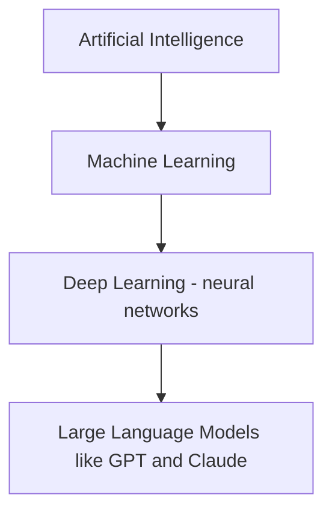
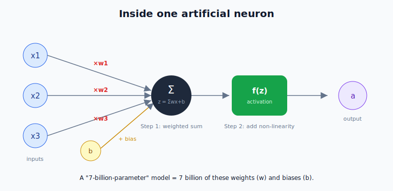
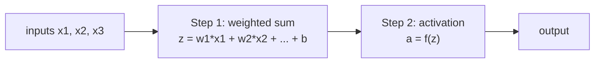
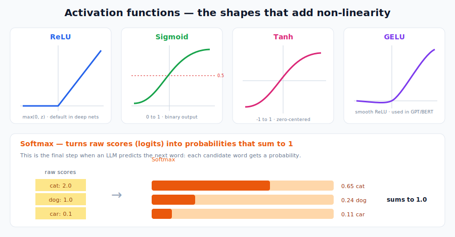
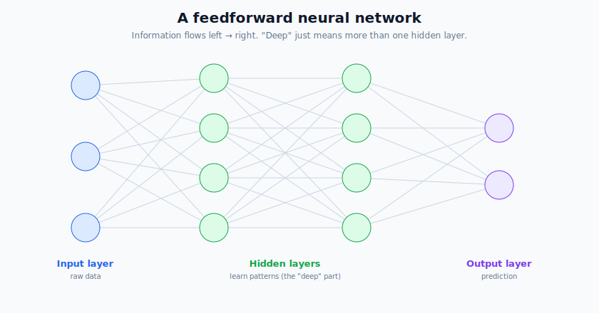
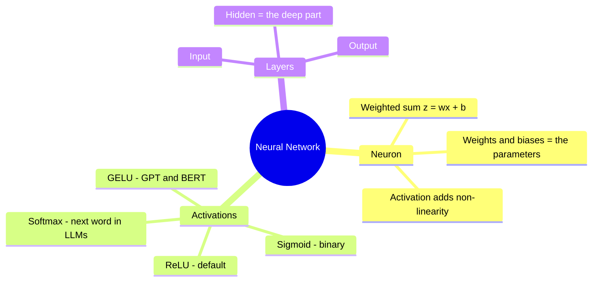

# Deep Learning: Neural Network Basics

> **What this file teaches you:** what a neural network actually *is*, built up from a single artificial neuron. By the end you'll understand the sentence "a 7-billion-parameter model" literally — you'll know exactly what those parameters are.

**Where Deep Learning fits:** it's a *sub-field* of Machine Learning that uses Artificial Neural Networks. It's the technology behind LLMs, self-driving cars, and image generators.

The key upgrade over the classic algorithms in §2: with §2 methods *you* hand-crafted the features (remember feature engineering?). Neural networks **learn their own features** automatically — that's what makes them so powerful, and why they took over.

---

## 1. The Artificial Neuron — the LEGO brick of all AI

Everything starts with one tiny unit: the **artificial neuron** (also called a "node" or "perceptron"), loosely inspired by brain cells. It takes several numbers in, does a quick calculation, and spits one number out.

It works in **two steps**:

### Step 1 — the weighted sum
Each input `x` is multiplied by a **weight** `w`, all of them are added up, and a **bias** `b` is added on top:

`z = (w1 · x1) + (w2 · x2) + ... + (wn · xn) + b`

- **Weights (w)** decide how *important* each input is. The network *learns* these. A big weight = "this input matters a lot."
- **Bias (b)** is a nudge that lets the neuron activate even when all inputs are zero — it shifts the result up or down.

> 🔑 **The "billion parameters" reveal:** when people say a model has *7 billion parameters*, those parameters are **exactly these weights and biases** — 7 billion little numbers the model tunes during training. That's all a model "is": a giant pile of weights.

### Step 2 — the activation function
The weighted sum `z` is just a straight line (linear). If you stacked millions of *purely linear* neurons, the whole network would mathematically collapse back into **one single straight line** — useless for complex patterns like language or images.

So we pass `z` through a non-linear **activation function** `f(z)`. This "bend" is what lets networks learn curves, edges, grammar, and everything interesting.

> **Intuition:** without activation functions, a 1000-layer network is no smarter than a single layer. The non-linearity is the whole point.

---

## 2. Activation Functions — the different "bends"

Different functions are used in different places.

| Function | Shape / output | Where it's used | Real-world example |
|----------|----------------|-----------------|--------------------|
| **ReLU** | 0 if negative, else passes through (`max(0,z)`) | the default in hidden layers — cheap and effective | image classifiers like ResNet |
| **Sigmoid** | squashes to **0–1** | final layer for **yes/no** problems | spam vs not-spam (your §2 project!) |
| **Tanh** | squashes to **−1 to 1**, zero-centered | sometimes in hidden layers (used in old RNNs) | early sequence models |
| **Softmax** | turns scores into **probabilities that sum to 1** | final layer for **multi-class** problems | **predicting the next word in an LLM** |
| **GELU** | a smooth version of ReLU | hidden layers of modern Transformers | **GPT and BERT use GELU** |

The **Softmax** one is worth staring at — it's how an LLM finishes a prediction. The model produces a raw score ("logit") for every possible next word, and softmax converts those into probabilities. "The cat sat on the ___" → softmax might give `mat: 0.6, floor: 0.2, roof: 0.1, ...` — and the model picks from there.

> 🔗 **Connection back to §2:** the Sigmoid here is the *exact same S-curve* from Logistic Regression. A logistic regression model is literally **a single neuron with a sigmoid activation**. You already built one in the spam project.

---

## 3. Network Architecture — stacking neurons into layers

One neuron is weak. The magic comes from organizing thousands of them into **layers**.

- **Input layer** — receives the raw data (image pixels, or word embeddings for text).
- **Hidden layers** — the layers in between. This is where patterns are learned. More than one hidden layer = a **"Deep" Neural Network** (that's where "deep learning" gets its name). Early layers learn simple things (edges), later layers combine them into complex things (faces, meaning).
- **Output layer** — produces the final prediction.

When data flows strictly **forward** (input → output, no loops), it's called a **Feedforward Neural Network** — the simplest architecture, and the foundation for everything else (CNNs, RNNs, Transformers).

### 🌍 Real-world examples
- **Image recognition** (Google Photos, medical imaging): early hidden layers detect edges, deeper ones detect shapes, the deepest recognize whole objects.
- **The Transformer block inside GPT/Claude** contains feedforward networks exactly like this — just very wide and stacked dozens of times.
- **Recommendation systems** (YouTube, TikTok) feed your behavior through deep networks to predict what you'll watch next.

---

## 🧠 Summary

**One-line summary:** a neural network is just a huge stack of simple neurons; each does `weighted sum → activation`; the weights and biases *are* the model's parameters; and stacking them deep lets the network learn its own features — no manual feature engineering required.

But a fresh network has **random** weights, so it's useless until trained. *How* it learns — measuring error and adjusting those millions of weights — is the next file.

➡️ **Next file:** `02_Loss_Optimizers_LR.md`
