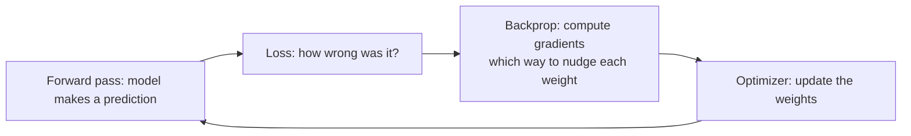
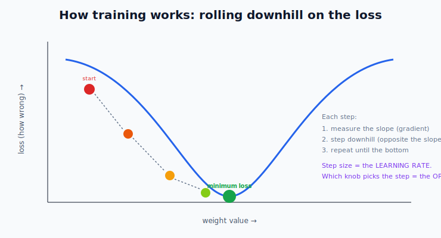
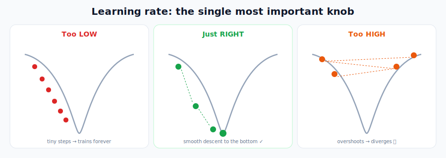
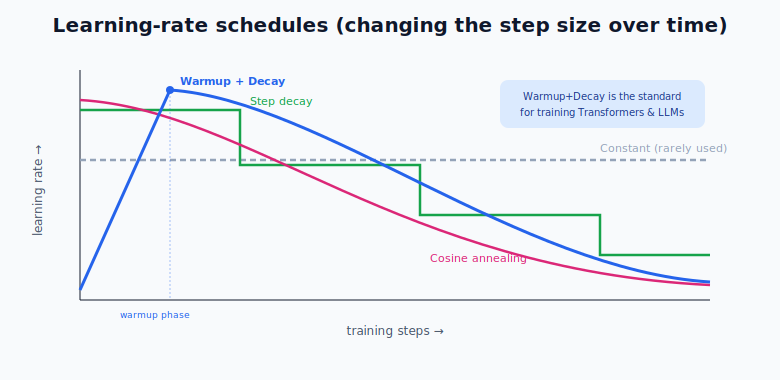
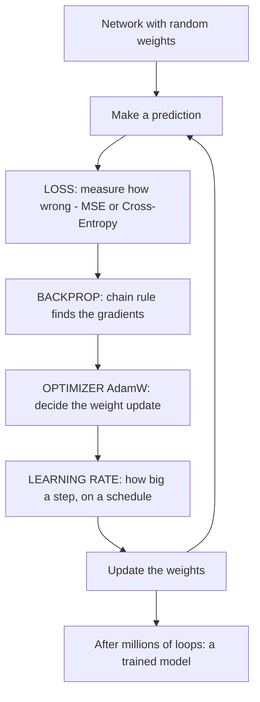

# Deep Learning: Loss, Optimizers & Learning Rates

> **What this file teaches you:** *how* a neural network actually learns. Building the network (last file) just gives you a brain with random wiring. This file is the training process that tunes those millions of weights from useless → smart.

Three pieces work together:
1. **Loss** — a number measuring how *wrong* the model is right now.
2. **Optimizer** — the engine that adjusts the weights to make the loss smaller.
3. **Learning rate** — how *big* each adjustment step is.

Here's the loop they form, repeated millions of times:

---

## 1. Loss Functions — measuring "how wrong"

The **loss function** (or cost function) turns "how badly did the model do?" into a single number. The entire goal of training is to make this number as **small as possible**.

| Loss function | Used for | Plain meaning | Real-world example |
|---------------|----------|---------------|--------------------|
| **Mean Squared Error (MSE)** | **Regression** (predicting numbers) | average of the squared gaps; punishes big misses hard | predicting house prices |
| **Cross-Entropy** | **Classification** (predicting categories) | how far the predicted probabilities are from the truth | **next-word prediction in an LLM** |
| **KL Divergence** | comparing two probability distributions | how different distribution A is from distribution B | **RLHF** (the PPO step that aligns ChatGPT/Claude) |
| **Hinge Loss** | SVMs & ranking | punishes wrong *and* "not confident enough" answers | SVM text classifiers |

> 🔗 **The two you'll use most:** MSE for number-prediction (like the §2 house-price idea) and **Cross-Entropy** for everything classification — including every single word an LLM predicts. When GPT trains, it's minimizing cross-entropy loss on "what's the next token."

---

## 2. Optimizers — the engine that fixes the weights

Once we have a loss, we use **backpropagation** (the **chain rule** from the §1 calculus module, finally doing real work) to compute **gradients**. A gradient is just a slope: it tells us *which direction* each weight should move to make the loss go up — so we move the **opposite** way to bring the loss **down**.

Picture the loss as a valley and the model as a ball rolling to the bottom:

The **optimizer** decides *exactly how* to take each downhill step. They got smarter over time:

| Optimizer | What it added | Analogy |
|-----------|---------------|---------|
| **SGD** (Stochastic Gradient Descent) | the original — step a bit in the downhill direction, using small batches of data | a careful hiker taking fixed steps |
| **RMSProp** | adapts the step size *per weight* (big steps on flat ground, small on steep) | a hiker who slows down on cliffs |
| **Adam** | combines momentum (remembering past direction) **+** RMSProp's adaptivity | a ball with momentum that also senses the terrain |
| **AdamW** | Adam **+** decoupled weight decay (cleaner L2 regularization) | the refined, generalization-friendly version |

> 🏆 **The one that matters for you: AdamW is the standard optimizer for training modern LLMs** — GPT, LLaMA, Claude-style models all use it. And its "weight decay" is the **L2 regularization** you learned in §2. So a §2 concept is literally running inside every frontier model's training.

---

## 3. Learning Rate — the most important knob in deep learning

The **learning rate (LR)** sets the **step size** the optimizer takes. Get it wrong and nothing else matters.

- **Too high** → the ball takes giant leaps, overshoots the bottom, and bounces *up* the walls — the loss explodes and training "diverges." 💥
- **Too low** → microscopic steps; training takes forever and can get stuck in a shallow dip.
- **Just right** → smooth, steady descent to the minimum. ✓

Because no *single* learning rate is perfect for the whole run, we **change it over time** using a **schedule**:

| Schedule | What it does |
|----------|--------------|
| **Constant** | never changes (rarely used in modern models) |
| **Step Decay** | cut the LR by a factor every N epochs (e.g. halve it every 10) |
| **Cosine Annealing** | smoothly glide the LR down following a cosine curve |
| **Warmup + Decay** | start near 0, **ramp up** for the first few thousand steps, then decay down |

> 🔑 **Why Warmup matters for Transformers/LLMs:** Adam/AdamW rely on running averages of gradients, and at the very start of training those averages are wild and unreliable. Launching at full learning rate would instantly break the model. So we **warm up** — gently increase the LR from 0 to its max over the first few thousand steps — *then* decay it. **This is standard practice for training every large Transformer**, and GPT-3's training used exactly this.

### 🌍 Real-world examples
- **Training GPT-3 / LLaMA:** AdamW + a warmup-then-cosine-decay learning-rate schedule, run for weeks on thousands of GPUs.
- **Fine-tuning any model:** the first thing practitioners tune is the learning rate; a 10x change can be the difference between a great model and a broken one.
- **"Loss went to NaN":** the classic beginner bug — almost always a learning rate set too high.

---

## 🧠 How it all fits together

**One-line summary:** training = repeat *(predict → measure loss → backprop gradients → optimizer nudges weights by a learning-rate-sized step)* millions of times. **Loss** says how wrong, **AdamW** does the fixing, and the **learning rate (with warmup + decay)** controls the step size — and this exact recipe trains every modern LLM.

➡️ **Next module:** `04_Neural_Network_Architectures/` — taking these neurons and arranging them into the famous shapes: CNNs, RNNs, and finally the **Transformer**.
