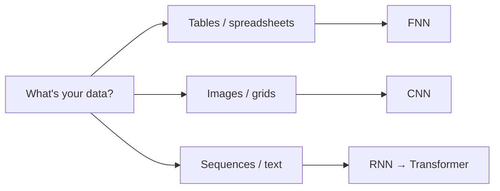
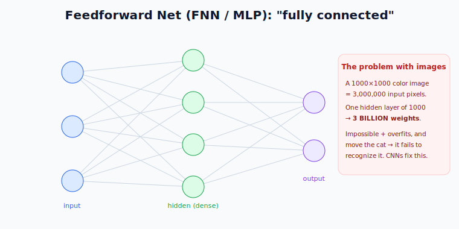
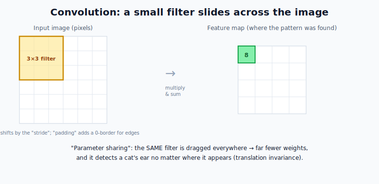
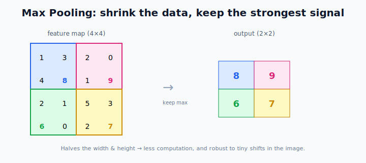
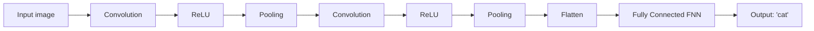

# Neural Network Architectures: FNN & CNN

> **What this file teaches you:** that the *arrangement* of neurons matters as much as the neurons themselves. The same building block (from §3) can be wired into different "shapes," each suited to a different kind of data. We start with the simplest shape (FNN) and the one that conquered images (CNN).

The big idea: **architecture = how you connect the neurons**, and the right architecture depends on your data.

---

## 1. Feedforward Neural Network (FNN / MLP)

The **Feedforward Neural Network** — also called a **Multi-Layer Perceptron (MLP)** — is the simplest architecture, and the one you already met in §3.

- **Information flows one way:** input → hidden → output, no loops.
- **Fully connected ("Dense"):** every neuron in one layer connects to *every* neuron in the next. That's why it's also called a "dense" network.
- **Best for:** **tabular data** — spreadsheets where features have no spatial or sequential relationship (like the churn dataset you built: tenure, charges, contract type).

### The limitation
Because everything connects to everything, FNNs have a **huge** number of parameters, which makes them wasteful — and they fall apart on images. Feed a 1000×1000 color image into an FNN and the input layer alone needs **3,000,000** neurons; connecting that to even one hidden layer of 1,000 neurons needs **3 billion weights**. That's computationally hopeless and overfits instantly. Worse: an FNN that learns a cat in the top-left corner *won't recognize the same cat* in the bottom-right, because it ties knowledge to exact pixel positions.

### 🌍 Real-world use
- Predicting house prices, loan defaults, or customer churn from tabular features.
- The **feedforward sub-layer inside every Transformer block** is an FNN (you'll see it in file 3).

---

## 2. Convolutional Neural Network (CNN)

**CNNs** were built to fix the FNN's image problem, and they **revolutionized computer vision**.

### Idea 1 — Filters (kernels) that slide
Instead of staring at the whole image at once, a CNN uses tiny grids of weights called **filters** (e.g. 3×3) that **slide across** the image hunting for a specific pattern — an edge, a curve, a color.

As the filter slides ("convolves"), it multiplies its weights against the pixels underneath and sums them, producing a **feature map** that lights up wherever the pattern appears.

Two important knobs:
- **Stride** — how many pixels the filter jumps each step (bigger stride = smaller output).
- **Padding** — adding a border of zeros so edge pixels get processed fairly and the output doesn't shrink too fast.

### Idea 2 — Parameter sharing
The **same filter** (same weights) is dragged across the *entire* image. This is huge:
- It slashes the number of parameters (one small filter vs. millions of connections).
- It gives **translation invariance** — if the filter learns to detect a cat's ear, it finds that ear *anywhere* in the image. (The exact thing FNNs couldn't do.)

### Idea 3 — Pooling (downsampling)
After convolution, a **pooling** layer shrinks the feature map. **Max pooling** slides a small window and keeps only the largest value:

This cuts computation and makes the network robust to small shifts and distortions.

### The full CNN pipeline

Early conv layers detect simple features (edges); deeper ones combine them into complex features (eyes, then faces). At the end, a small FNN makes the final decision.

### 🌍 Real-world use
- **Face ID** on your phone and photo tagging in Google Photos.
- **Medical imaging** — detecting tumors in X-rays and MRIs.
- **Self-driving cars** — recognizing pedestrians, signs, and lanes.
- **Vision Transformers** later borrowed ideas from CNNs, and CNNs still power many image systems today.

---

## 🧠 Summary

| Architecture | Best for | Key trick | Weakness |
|--------------|----------|-----------|----------|
| **FNN / MLP** | tabular data | fully connected layers | wasteful; bad on images & text |
| **CNN** | images / grids | sliding filters + parameter sharing | not built for sequences/order |

**One-line summary:** an FNN connects everything to everything (great for tables, terrible for images), while a CNN slides small shared filters across a grid to find patterns efficiently — the breakthrough that made computer vision work. But neither handles **order**, which is exactly what language needs.

➡️ **Next file:** `02_RNN_LSTM_GRU.md` — architectures with *memory*, for sequential data like text.
