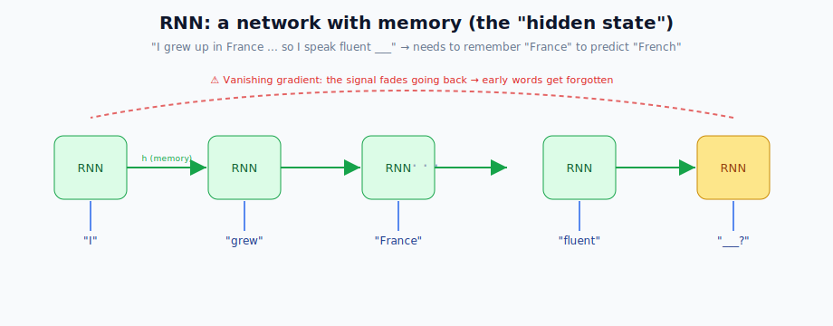
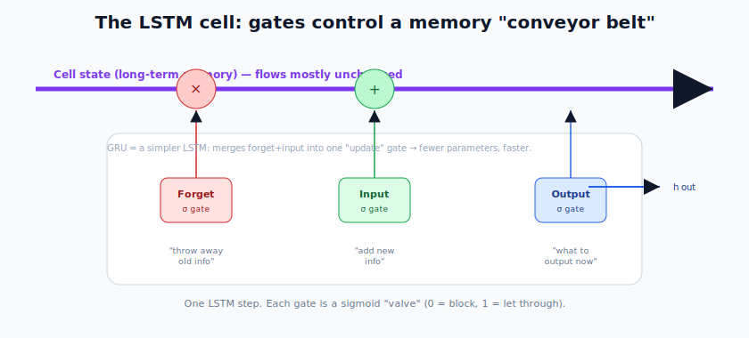
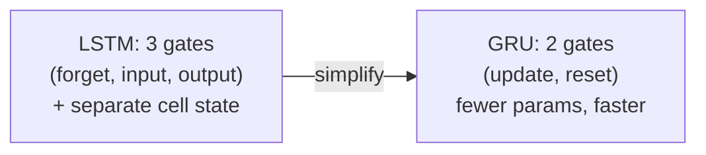
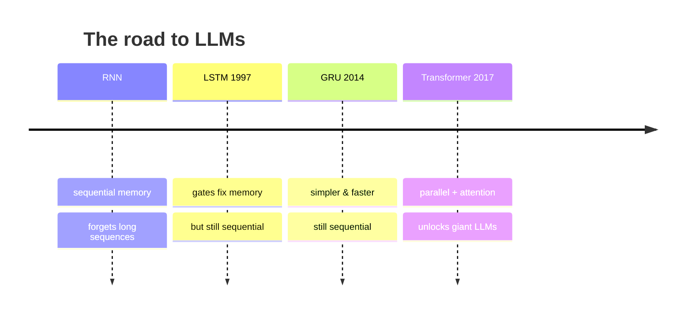

# Neural Network Architectures: RNN, LSTM & GRU

> **What this file teaches you:** how networks handle data where **order matters** (text, audio, time series), why the first attempt (RNN) failed on long sequences, how LSTMs fixed it — and why even LSTMs were eventually replaced, setting the stage for the Transformer.

CNNs are great at images but blind to **order**. Consider: *"I grew up in France, so I speak fluent ___."* To predict **"French"**, the network must *remember* the word "France" from earlier in the sentence. FNNs and CNNs have **no memory** of previous inputs. We need a new shape.

---

## 1. Recurrent Neural Networks (RNN)

RNNs were the first architecture built for **sequential data**. Their trick: a **loop**. The network's output at one step is fed back in as an input at the *next* step, creating an internal memory called the **hidden state**.

- **Hidden state (`h`)** = the network's running memory of everything it has seen so far.
- At each step, the new memory blends the current word with the previous memory:
  `h_new = f(W_input · x_current + W_hidden · h_previous + bias)`

### The fatal flaw: vanishing gradients
On long sequences, RNNs break. Training a 100-word sentence means backpropagating through 100 steps, and because the same weight matrix is multiplied over and over, the learning signal (gradient) either **shrinks to zero** (vanishing) or **blows up** (exploding). When it vanishes, the network simply *stops learning* the early words. The result: RNNs have very **short-term memory** and forget the start of long sentences — so they'd never connect "France" to "French" across a long gap.

### 🌍 Real-world use (historically)
- Early text generation, speech recognition, and stock-price prediction.

---

## 2. Long Short-Term Memory (LSTM)

Invented in **1997**, LSTMs solved the vanishing-gradient problem and ruled NLP until 2017. Their secret is a separate **cell state** — a "conveyor belt" of memory that runs straight through the sequence, so information can travel far **without being scrambled**.

The cell state is controlled by three **gates**, each a sigmoid "valve" (outputs 0–1, where 0 = block, 1 = let through):

1. **Forget gate** — decides what old memory to *throw away*. (Example: the subject switched from singular to plural → forget the old conjugation.)
2. **Input gate** — decides what new information to *add* to the memory.
3. **Output gate** — decides what part of the memory to *reveal* as this step's output.

Thanks to this gating, LSTMs can hold information across **thousands** of steps — finally remembering "France" long enough to say "French."

### 🌍 Real-world use
- **Google Translate** ran on LSTMs (2016) before Transformers.
- **Siri / Alexa** speech recognition, autocomplete, and time-series forecasting.

---

## 3. Gated Recurrent Unit (GRU)

The **GRU** (2014) is a **simplified LSTM**:

- It **merges** the forget and input gates into a single **"update gate"**, and combines the cell state and hidden state into one.
- Fewer gates = **fewer parameters = faster training**.
- **Trade-off:** LSTMs are slightly more powerful on very long sequences, but GRUs often match them on many tasks in less time.

---

## Why we moved past LSTMs (the cliffhanger)

LSTMs and GRUs are brilliant, but they share one **fatal flaw for the modern era: sequential processing**. You *must* finish word 1 before word 2, word 2 before word 3. This means they **can't be parallelized** across a GPU's thousands of cores. That bottleneck made it impossible to scale them to the enormous sizes modern LLMs need.

That single limitation — *can't go parallel* — is exactly what the Transformer demolished.

---

## 🧠 Summary

| Architecture | Memory | Key idea | Fatal flaw |
|--------------|--------|----------|------------|
| **RNN** | short | a hidden-state loop | vanishing gradients |
| **LSTM** | long | cell state + 3 gates | sequential (slow) |
| **GRU** | long | simplified LSTM, 2 gates | sequential (slow) |

**One-line summary:** RNNs gave networks memory but forgot long sequences; LSTMs/GRUs fixed memory with gates and a conveyor-belt cell state; but all of them must process words one-at-a-time, which couldn't scale — opening the door to the Transformer.

➡️ **Next file:** `03_Transformers.md` — the architecture that powers every modern LLM.
