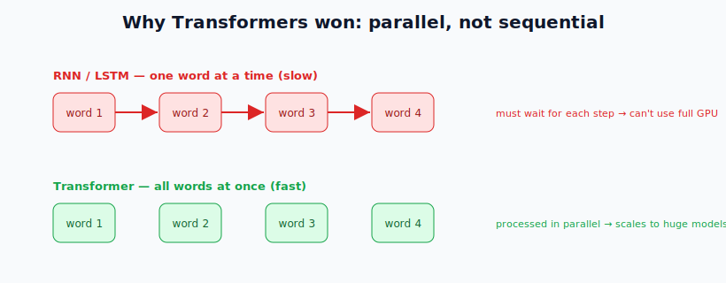
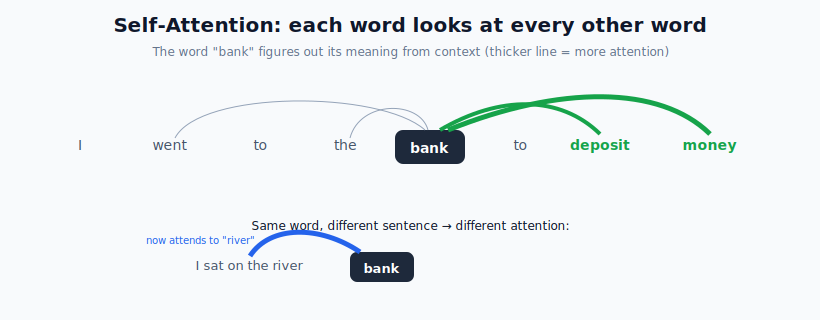
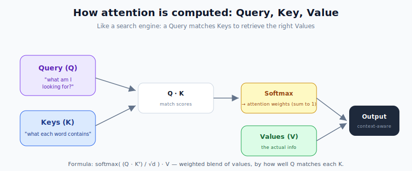
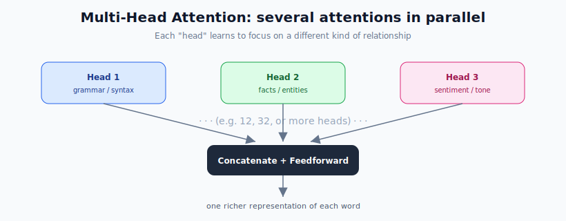
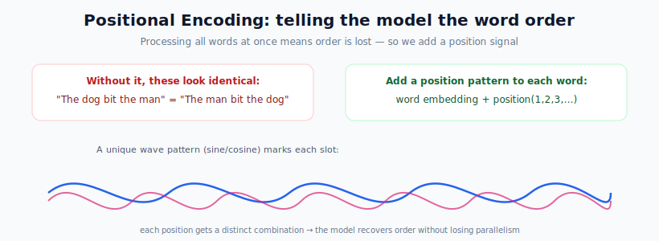
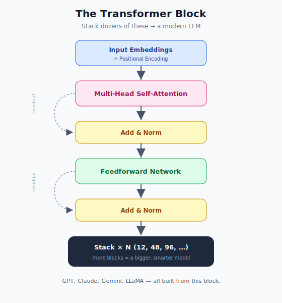
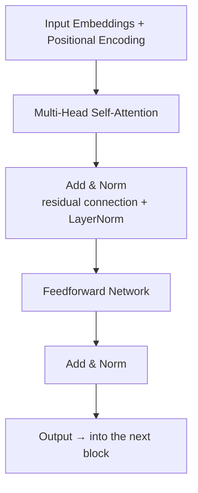
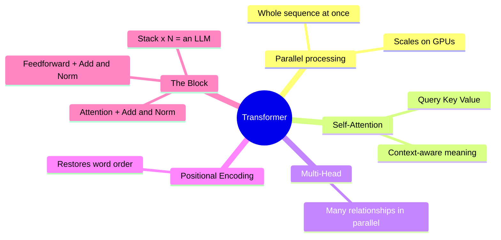

# Neural Network Architectures: Transformers

> **What this file teaches you:** the single most important architecture in modern AI. In 2017 a Google paper, *"Attention Is All You Need,"* introduced the **Transformer**, replaced LSTMs, and sparked the entire LLM revolution. **Every modern LLM — GPT-4, Claude, Gemini, LLaMA — is a Transformer.** This is the destination the whole curriculum has been building toward.

---

## 1. The core breakthrough: parallel, not sequential

Recall the fatal flaw from the last file: RNNs/LSTMs read text **one word at a time**, so they couldn't use a GPU's massive parallelism. The Transformer **threw out recurrence entirely** and instead ingests the **whole sequence at once**, processing every word in parallel.

This one change is what made it possible to train models with billions of parameters on enormous datasets.

---

## 2. Self-Attention — how words understand context

If all words are processed at once, how does the model know which words relate to each other? Through the **self-attention mechanism**: when processing a word, the model **looks at every other word in the sentence simultaneously** and computes a **relevance score** (attention weight) to each one.

- In *"I went to the **bank** to deposit money,"* the word "bank" pays high attention to **"deposit"** and **"money"** → it means a financial bank.
- In *"I sat on the river **bank**,"* the same word now attends to **"river"** → it means a riverbank.

Same word, completely different meaning, resolved purely by what it attends to. That's context understanding.

### How attention is computed: Query, Key, Value
Attention works like a **search engine** using three vectors per word:

- **Query (Q)** — what the current word is *looking for*.
- **Key (K)** — what each word *advertises* about itself.
- **Value (V)** — the actual *information* each word carries.

The model matches the Query against all Keys (a dot product) to get scores, runs them through **Softmax** to turn them into weights that sum to 1, then takes a weighted blend of the Values. The formula:

`Attention = softmax( (Q · Kᵀ) / √d ) · V`

The closer a word's Key matches the Query, the more its Value contributes to the result.

---

## 3. Multi-Head Attention — many perspectives at once

A word plays several roles at once (it can be a grammatical subject *and* carry sentiment *and* be a key fact). One attention mechanism can only focus on one type of relationship, so Transformers run **many attention "heads" in parallel**.

In a 12-head Transformer, for example, one head might track grammar, another factual relationships, another tone. Their outputs are **concatenated** and passed through a feedforward network, giving each word a far richer representation than any single head could.

---

## 4. Positional Encoding — restoring word order

Processing all words at once creates one problem: the model has **no idea what order they came in**. To a bare Transformer, *"The dog bit the man"* and *"The man bit the dog"* look identical — a disaster for meaning.

The fix: before feeding words in, we **add a positional pattern** (built from sine and cosine waves) to each word's representation. Each position gets a unique signal, so the model recovers word order **without** giving up its parallel-processing speed.

---

## 5. The Transformer Block — putting it all together

Stack the pieces and you get the **Transformer block**:

The two extra pieces:
- **Add & Norm** — a **residual connection** (add the layer's input to its output) plus **Layer Normalization**. Residuals let gradients flow cleanly through very deep stacks (preventing the vanishing-gradient problem from the RNN file), and normalization keeps training stable.
- The **Feedforward Network** is just the FNN from file 1, applied to each position.

**Modern LLMs are simply dozens to hundreds of these blocks stacked on top of each other.** GPT-3 has 96 of them; bigger models have more. That's the whole secret.

### 🌍 Real-world: this *is* the LLM era
- **ChatGPT, Claude, Gemini, LLaMA** — all decoder-style Transformer stacks predicting the next token.
- **BERT** — an encoder-style Transformer powering Google Search.
- **Vision Transformers (ViT)** apply the same attention idea to image patches.
- Translation, code generation, protein folding (AlphaFold) — all Transformer-based.

---

## 🧠 Summary

**One-line summary:** the Transformer processes all words in parallel and uses **self-attention** (Query/Key/Value) to let every word understand its context, runs **multiple attention heads** for multiple relationships, adds **positional encoding** to keep word order, and stacks dozens of these blocks — which is exactly what GPT, Claude, and every modern LLM are made of.

You now understand the architecture behind the entire field. 🎉

➡️ **Next module:** `05_Large_Language_Models/` — taking this Transformer and turning it into a full LLM (GPT vs BERT, scaling laws, and the pretraining → fine-tuning → RLHF pipeline).
