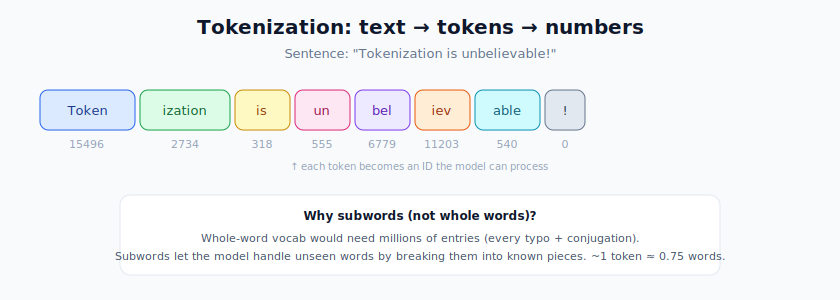
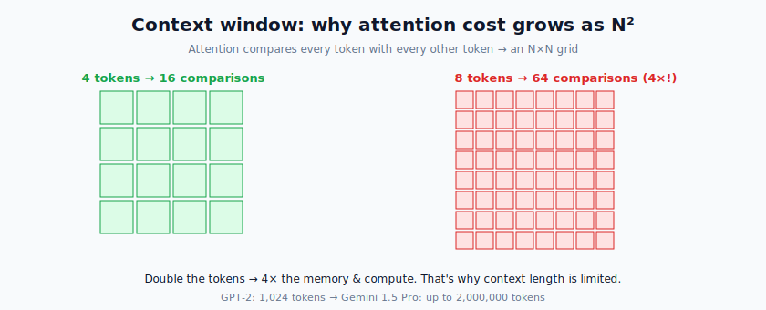
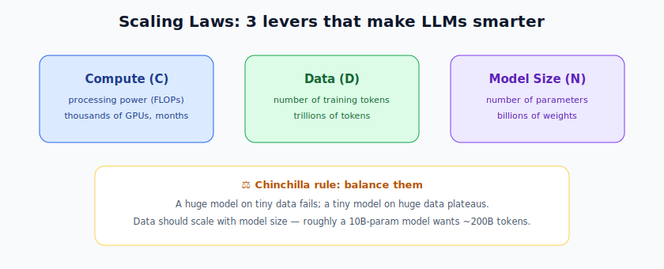
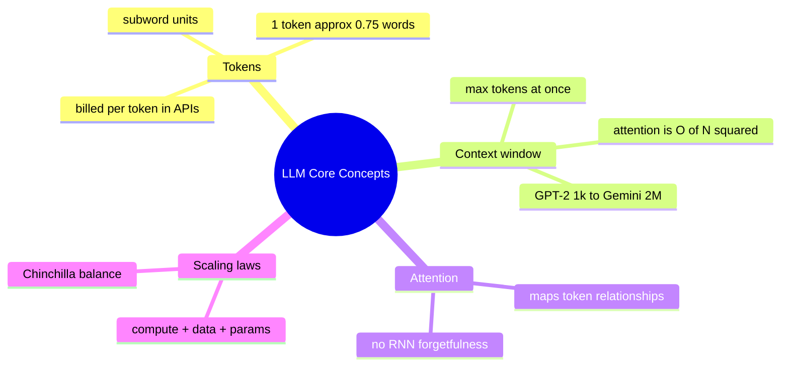

# Large Language Models: Core Concepts

> **What this file teaches you:** the vocabulary and ground rules of LLMs — what a "token" really is, why models have a context limit, and the "scaling laws" that explain why throwing more data and compute at a Transformer makes it smarter. These four ideas come up in *every* conversation about LLMs.

An **LLM** is the most advanced application of deep learning today, built entirely on the **Transformer** architecture from §4. Now we zoom into the concepts that make a Transformer into a *language* model.

---

## 1. Tokens & Vocabulary

Before any text reaches the network, it must become numbers. That conversion is **tokenization**.

- A **token** is the basic unit an LLM processes. It's **not** always a full word — it can be a whole word ("apple"), a subword ("ing"), or a single character. Each token maps to an ID number.
- **Why not just use whole words?** A whole-word vocabulary would need *millions* of entries to cover every conjugation and typo. **Subword tokenization** (like BPE, covered in §6) hits the sweet spot: a manageable vocabulary that can still handle words it's never seen by breaking them into known pieces.
- **Rule of thumb:** in English, **1 token ≈ 0.75 words**.

### 🌍 Real-world relevance
- **API pricing is per token.** When you pay for the OpenAI or Claude API, you're billed by tokens in + tokens out — so "tokens" is literally a cost unit.
- A 1,000-word email ≈ ~1,300 tokens.

---

## 2. Context Length (the Context Window)

The **context length** is the maximum number of tokens a model can take in at once — its "working memory" for a single request.

- **Why is there a limit?** Self-attention compares every token to every other token, so its cost scales **quadratically — O(N²)**. Double the tokens and you *quadruple* the memory and compute. That quadratic wall is the reason context can't just be infinite.
- **It's grown enormously:** GPT-2 handled 1,024 tokens; modern models like Gemini 1.5 Pro reach up to **2,000,000 tokens** — enough to read entire books or codebases at once.

> **Practical impact:** if your document is longer than the context window, the model literally cannot see all of it in one pass — which is exactly the problem that RAG (§16) was invented to solve.

---

## 3. Attention in LLMs

LLMs rely **entirely** on the self-attention you learned in §4. Inside an LLM, attention maps the grammatical and semantic relationships among all tokens in your prompt. When predicting the next word, it places large mathematical weight on the most relevant earlier tokens — completely sidestepping the "forgetfulness" that crippled RNNs.

This is the bridge from §4 to here: *attention is the mechanism, and an LLM is attention applied at massive scale to predict the next token.*

---

## 4. Scaling Laws — why bigger got smarter

The engine behind the recent AI explosion is **scaling laws**: research showed that an LLM's performance improves *predictably* with three levers.

1. **Compute (C)** — total processing power used in training (FLOPs).
2. **Dataset size (D)** — total tokens the model reads.
3. **Model size (N)** — total parameters (weights & biases).

But you **can't just crank up one lever**. A 1-trillion-parameter model trained on tiny data performs terribly; a tiny model trained forever on huge data hits diminishing returns. The famous **Chinchilla scaling laws** (DeepMind) give the mathematically optimal *ratio* between model size and data for a given compute budget. The rule of thumb: **data should scale with model size** — e.g. a ~10B-parameter model wants roughly ~200B training tokens.

> 🔗 **Connection to §3:** "performance" here is measured by the **cross-entropy loss** on next-token prediction — the same loss function from the Deep Learning module, just computed over trillions of tokens.

### 🌍 Real-world relevance
- Chinchilla showed that many early large models were *under-trained* — too big for their data — reshaping how labs budget compute.
- It's why a well-trained smaller model (e.g. LLaMA-7B) can beat a poorly-balanced bigger one.

---

## 🧠 Summary

**One-line summary:** text becomes **tokens** (subword IDs), the **context window** caps how many fit at once (limited by attention's O(N²) cost), **attention** relates them, and **scaling laws** say performance grows predictably when you balance compute, data, and model size.

➡️ **Next file:** `02_Architectures.md` — the specific LLM designs: GPT vs BERT, and the modern upgrades (LLaMA, MoE).
