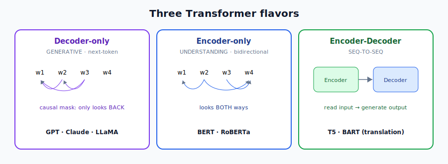
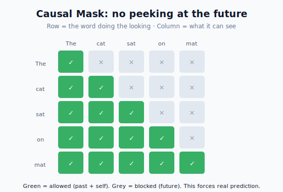
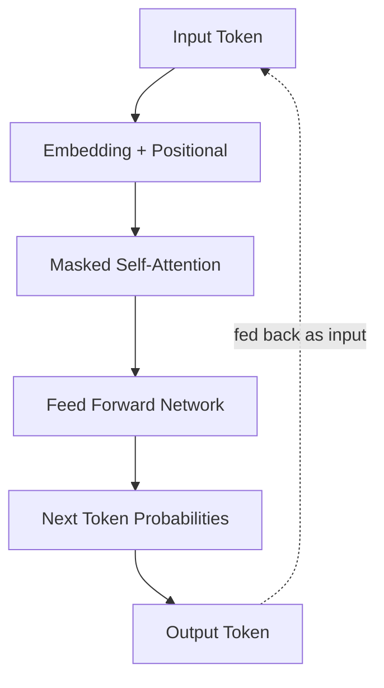
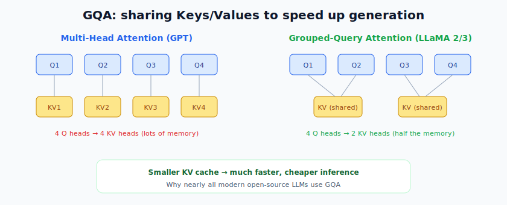
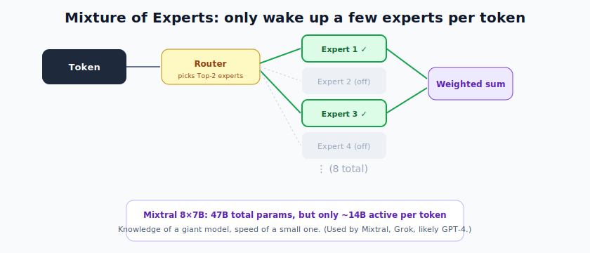
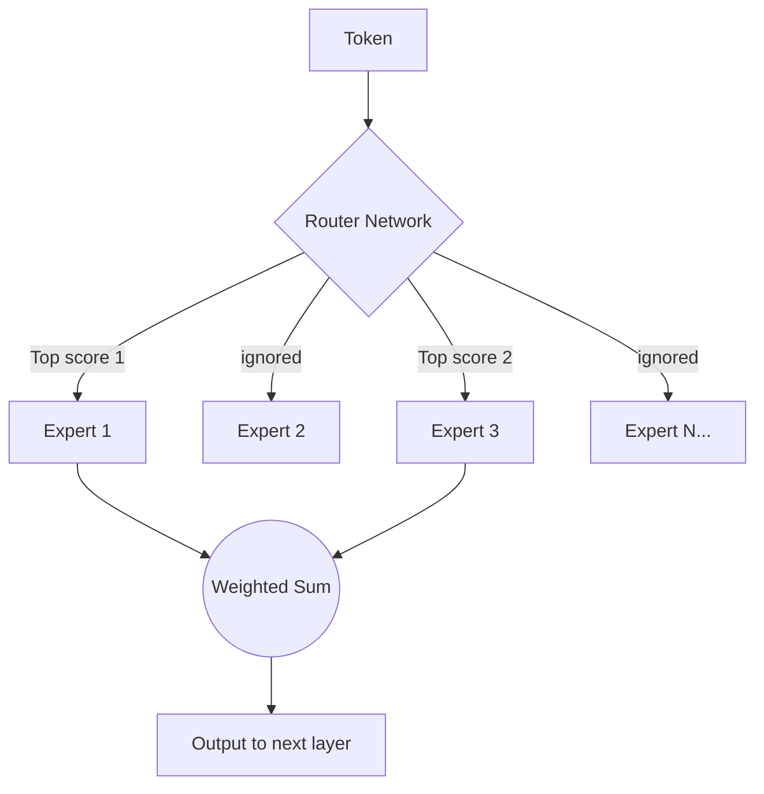

# Large Language Models: Important Architectures

> **What this file teaches you:** the different ways a Transformer can be wired into an LLM, and the clever upgrades that took us from the original GPT to today's efficient models. We'll cover the three high-level types, then deep-dive GPT, LLaMA, and Mixture-of-Experts.

The original 2017 Transformer had **both** an Encoder and a Decoder. Researchers soon realized you don't always need both, and then layered on upgrades for speed, memory, and reasoning.

---

## 1. The three high-level types

### Decoder-only (Generative) — the chatbots
The architecture behind almost every modern generative AI (ChatGPT, Claude, LLaMA, Mistral).
- Trained on **next-token prediction**, generating text **auto-regressively** (one token at a time, feeding each output back in).
- Uses a **causal mask**: a token may only attend to **previous** tokens, never future ones — which forces the model to genuinely *predict* rather than peek.

### Encoder-only (Understanding) — the analyzers
- Reads the whole sequence **bidirectionally** (word 5 can attend to word 10).
- Famous models: **BERT, RoBERTa**.
- Used for sentiment analysis and **semantic search** (creating embeddings for vector databases).

### Encoder-Decoder (Sequence-to-Sequence) — the translators
- The encoder reads the input bidirectionally into a dense representation; the decoder generates the output auto-regressively.
- Famous models: **T5, BART**. Used for translation and summarization.

---

## 2. Deep Dive: the GPT architecture

OpenAI's **GPT** (Generative Pre-trained Transformer) standardized the **decoder-only** approach. Its key technical choices:

- **Pre-Layer Normalization** — GPT moved `LayerNorm` to *before* the attention and feed-forward blocks, which dramatically stabilized training of deep networks.
- **GELU activation** (from §3) instead of ReLU — smoother, allows small negative values, helps gradients flow.
- **Absolute positional encodings** — learned position embeddings added at the input.

---

## 3. Deep Dive: the LLaMA architecture

Meta's **LLaMA** upgraded the GPT baseline so successfully that most modern open-source models (Mistral, Qwen) copy it. Four key changes:

### 3.1 RMSNorm
Instead of standard LayerNorm, LLaMA uses **RMSNorm**, which normalizes by the root-mean-square magnitude but skips the mean-centering step — equally stable, but **faster** to compute.

$$RMS(x) = \sqrt{\frac{1}{d} \sum_{i=1}^{d} x_i^2 + \epsilon}$$

### 3.2 RoPE (Rotary Positional Embeddings)
Instead of *adding* absolute positions at the start, **RoPE** encodes position **multiplicatively during attention** by rotating the query and key vectors. This gives the model a much better sense of the **relative distance** between words — crucial for long context windows.

### 3.3 SwiGLU activation
LLaMA replaces GELU with **SwiGLU**, which adds a gating mechanism to the feed-forward network for better performance (at a slight parameter cost).

$$SwiGLU(x) = Swish_\beta(xW) \otimes xV$$

### 3.4 GQA (Grouped-Query Attention) — LLaMA 2 & 3
Standard Multi-Head Attention gives every Query head its own Key/Value head. **GQA** lets several Query heads **share** one Key/Value head, shrinking the memory needed during generation (the KV cache) and making inference much faster.

---

## 4. Deep Dive: Mixture of Experts (MoE)

Models like **Mixtral 8×7B, Grok, and (likely) GPT-4** use MoE to get the benefits of huge size without the full cost.

### The problem with "dense" models
In a dense model (e.g. LLaMA-3-8B), **every** parameter processes **every** token. Scale that to 100B+ parameters and it becomes too slow and expensive to run.

### The MoE solution (sparse gating)
MoE replaces the single big feed-forward network in each block with several smaller ones called **experts** (e.g. 8).

1. A small **router network** scores which experts suit the current token.
2. **Top-K routing** picks only the best few (e.g. top 2).
3. **Sparsity** — the rest are ignored (multiplied by zero).

The router output $G(x)$ gives routing weights; with expert outputs $E_i(x)$:

$$ y = \sum_{i \in \text{TopK}} G(x)_i \cdot E_i(x) $$

### The payoff (decoupled compute)
Mixtral 8×7B has **47B total parameters** (vast knowledge) but activates only **~14B per token** — the intelligence of a big model at the speed of a small one.

### Load-balancing loss
Routers can get "lazy" and overuse a couple of experts. To prevent that, MoE training adds an auxiliary **load-balancing loss** that penalizes uneven expert usage, keeping all experts trained.

---

## 🧠 Summary

| Architecture | Reads | Best for | Examples |
|--------------|-------|----------|----------|
| **Decoder-only** | backward (causal) | generation / chat | GPT, Claude, LLaMA |
| **Encoder-only** | both directions | understanding / search | BERT, RoBERTa |
| **Encoder-Decoder** | encode then generate | translation / summarization | T5, BART |

Modern efficiency upgrades: **RMSNorm** (faster norm), **RoPE** (better relative positions), **SwiGLU** (better FFN), **GQA** (cheaper inference), and **MoE** (huge knowledge, low active compute).

**One-line summary:** decoder-only Transformers power today's chatbots; GPT standardized the design; LLaMA refined it (RMSNorm, RoPE, SwiGLU, GQA); and MoE breaks the cost curve by activating only a few "experts" per token.

➡️ **Next file:** `03_Training_Phases.md` — how a raw Transformer becomes a helpful, aligned assistant.
