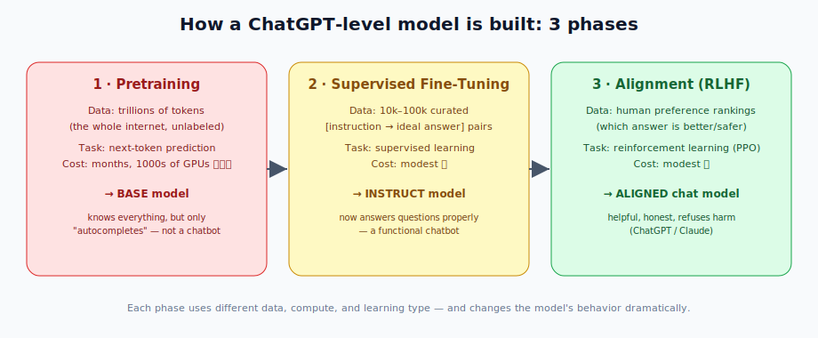
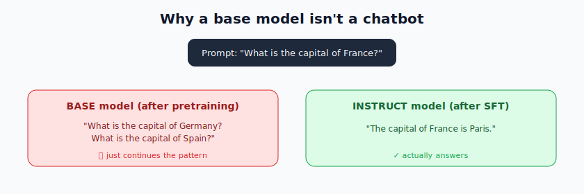
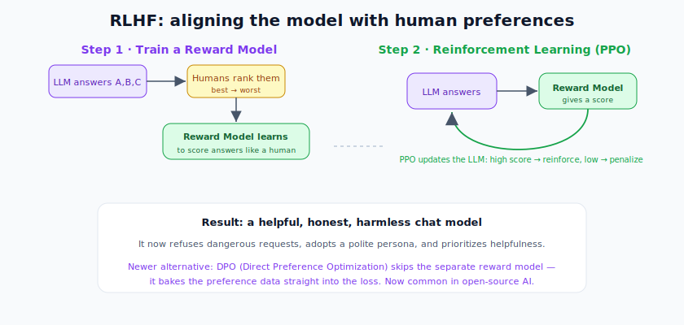
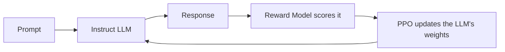

# Large Language Models: Training Phases

> **What this file teaches you:** the full assembly line that turns a Transformer into ChatGPT or Claude. It's **not one step** — it's a three-phase pipeline, and each phase uses different data, a different learning type, and changes the model's behavior dramatically.

Notice this pipeline uses **three of the four learning types from §2**: unsupervised (pretraining), supervised (fine-tuning), and reinforcement (alignment). It all comes together here.

---

## Phase 1 — Pretraining (the Base Model)

The most expensive phase by far: thousands of GPUs running for **months** on **trillions of tokens**.

- **Goal:** absorb the structure of language, world facts, reasoning, and coding syntax.
- **Data:** a massive, mostly unfiltered scrape of the internet — Wikipedia, books, academic papers, GitHub, forums. **Unlabeled** → this is **unsupervised learning**.
- **Objective:** **next-token prediction**. Show the model text, have it guess the next token, measure the error (cross-entropy loss from §3), backpropagate, update billions of weights. Repeat trillions of times.
- **Result:** a **Base Model** (e.g. GPT-3, LLaMA-2-70B).

**The catch:** base models are brilliant but **useless as assistants**. They only know how to *continue internet text*, not how to chat.

Ask a base model "What is the capital of France?" and it might just continue the *pattern* — "What is the capital of Germany? What is the capital of Spain?" — instead of answering. It needs to be taught the Q&A format.

---

## Phase 2 — Supervised Fine-Tuning (Instruction Tuning)

Now we teach the base model a new behavior: **respond to instructions** instead of autocompleting.

- **Goal:** turn "text completer" into "instruction follower."
- **Data:** a much smaller, **highly curated** set of `[instruction → ideal response]` pairs written by humans — typically tens of thousands to hundreds of thousands of examples.
- **Objective:** standard **supervised learning** (from §2) — the model is penalized when its output deviates from the human-written ideal answer.
- **Result:** an **Instruct model**. It now answers "The capital of France is Paris." A functional chatbot.

---

## Phase 3 — Alignment (RLHF)

An Instruct model follows directions but lacks **values** — it might cheerfully produce harmful content or confidently hallucinate. The final phase aligns it with human preferences for **helpfulness, honesty, and safety**.

The standard method is **RLHF (Reinforcement Learning from Human Feedback)**, done in two steps.

### Step 3.1 — Train a Reward Model
1. Give the Instruct model a prompt.
2. It generates several responses (A, B, C…).
3. **Human raters rank** them best-to-worst on safety and helpfulness.
4. Train a separate, smaller network — the **Reward Model** — on those rankings, so it learns to **mimic human preferences**: high score for good answers, low for bad.

### Step 3.2 — Reinforcement Learning (PPO)
1. The LLM answers a new prompt.
2. The **Reward Model scores** that answer.
3. A reinforcement-learning algorithm — usually **PPO (Proximal Policy Optimization)** — updates the LLM's weights: high score → reinforce that behavior, low score → discourage it.

- **Result:** a production-ready **aligned chat model** (ChatGPT, Claude) that refuses harmful requests, holds a consistent persona, and prioritizes being helpful.

> **The modern alternative — DPO:** **Direct Preference Optimization** skips the separate reward model entirely, baking the human-preference data straight into the loss function during fine-tuning. It's simpler and increasingly the standard in open-source AI.

> 🔗 **Connection to §2 & §3:** KL Divergence (a §3 loss) keeps the RLHF model from drifting too far from the instruct model, and the whole alignment step is **reinforcement learning** — the fourth learning type from §2, finally used in anger.

---

## 🧠 Summary

| Phase | Learning type | Data | Turns model into |
|-------|---------------|------|------------------|
| **1 · Pretraining** | unsupervised | trillions of internet tokens | Base model (knows everything, can't chat) |
| **2 · SFT** | supervised | 10k–100k curated Q&A pairs | Instruct model (functional chatbot) |
| **3 · RLHF / DPO** | reinforcement | human preference rankings | Aligned model (helpful, honest, safe) |

**One-line summary:** pretraining stuffs the model with knowledge via next-token prediction, supervised fine-tuning teaches it to follow instructions, and RLHF/DPO aligns it with human values — three phases, three learning types, one ChatGPT.

➡️ **Next module:** `06_Tokenization/` — a closer look at the tokenization step (BPE, WordPiece, SentencePiece) that feeds this whole pipeline.
