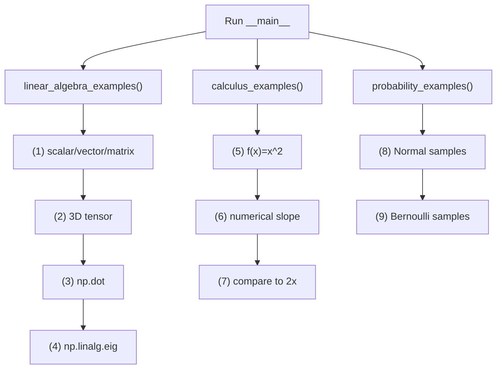
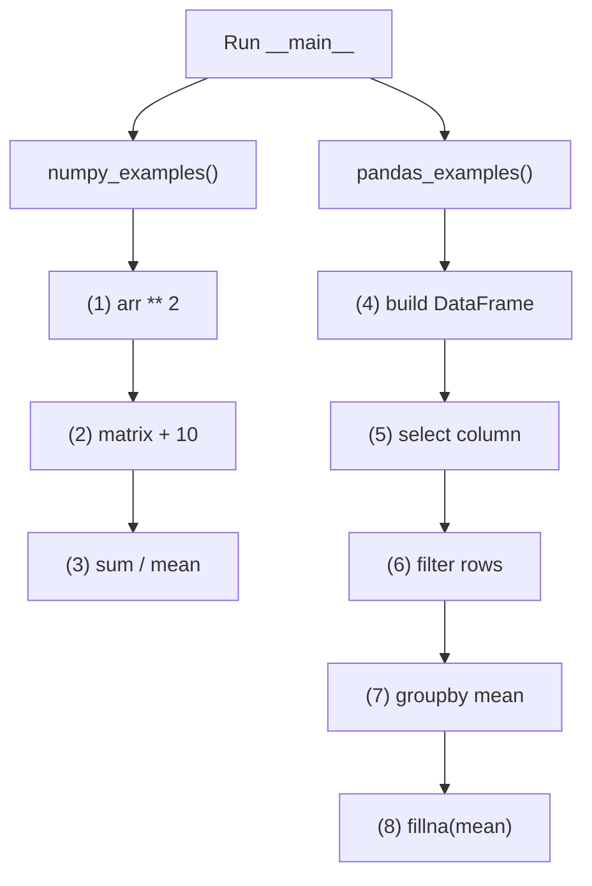
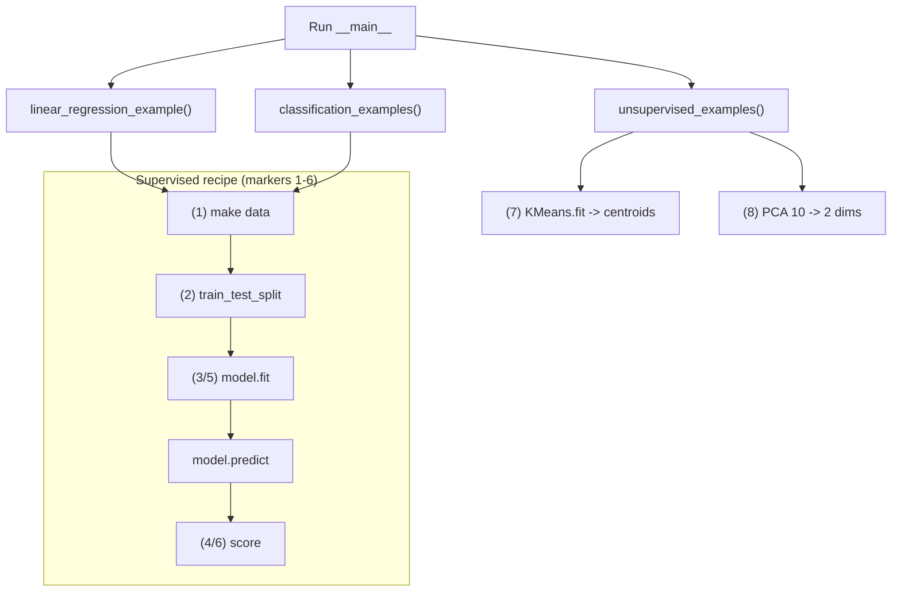
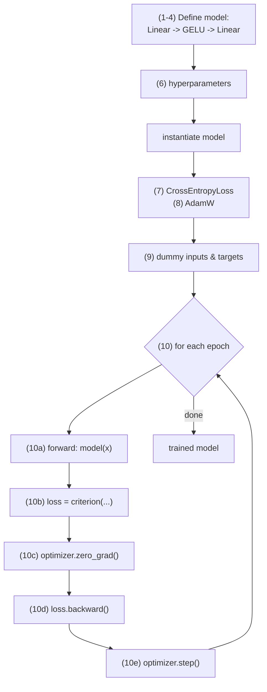
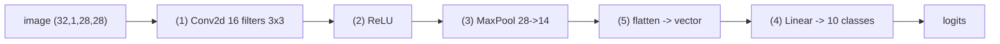
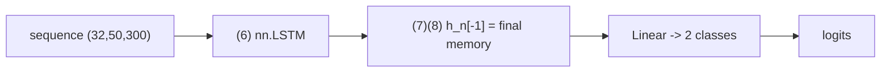
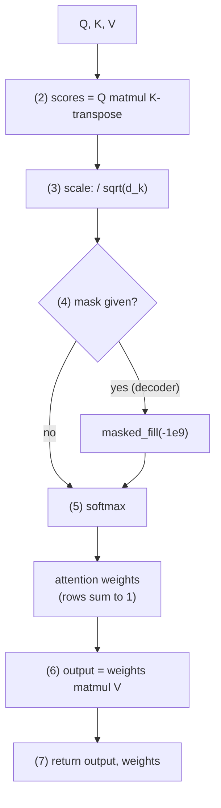
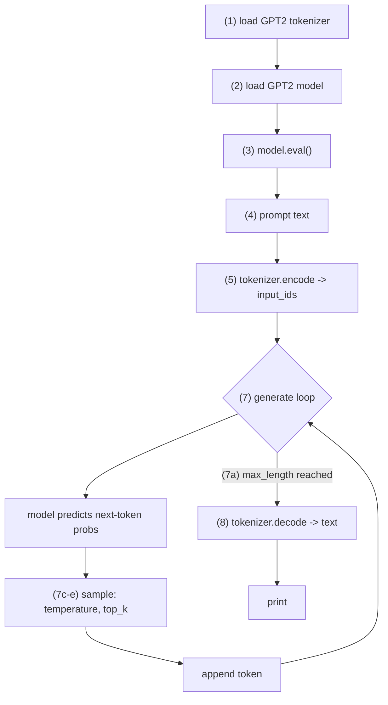
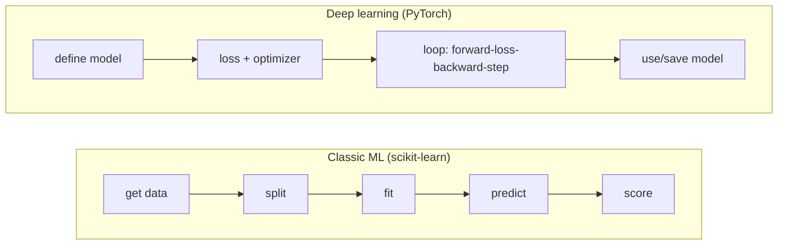

# 🧭 Code Deep-Dive & Flowcharts (§1 → §5)

> **How to read this:** for every code file you get (1) the **libraries** it uses, (2) the **actual code** with numbered markers like `# (3)`, (3) a **flowchart** of how it runs, and (4) a **piece-by-piece** breakdown where each item points to a marker in the code above it.

---

## Part 0 — The libraries, explained

| Library | Import seen as | What it is | Mental model |
|---------|----------------|------------|--------------|
| **NumPy** | `import numpy as np` | fast math on arrays/matrices | a turbo calculator for whole grids of numbers |
| **Pandas** | `import pandas as pd` | tables of data (rows & columns) | "Excel for Python" |
| **scikit-learn** | `from sklearn... import ...` | ready-made classic ML algorithms | pre-built models you `.fit()` and `.predict()` |
| **PyTorch** | `import torch` | build & train neural nets, GPU-ready | LEGO for neural nets + automatic calculus (autograd) |
| ↳ `torch.nn` | `import torch.nn as nn` | network building blocks | the bricks: layers, activations, losses |
| ↳ `torch.optim` | `import torch.optim as optim` | optimizers (AdamW, SGD) | the engine that updates weights |
| ↳ `torch.nn.functional` | `as F` | the ops as plain functions (`F.softmax`) | the stateless version of the bricks |
| **math** | `import math` | single-number math (`sqrt`) | a pocket calculator |
| **Transformers** (HF) | `from transformers import ...` | download/run pre-trained LLMs (GPT-2) | an app store for ready LLMs |

**Rule of thumb:** NumPy/Pandas = the *data*; scikit-learn = *classic* ML; PyTorch = *deep* learning; Transformers = *pre-trained LLMs*.

---

# §1 Foundations

## `01_math_basics.py`  ·  uses: **NumPy**

```python
import numpy as np

def linear_algebra_examples():
    scalar = 5                                          # (1)
    vector = np.array([1, 2, 3])                        # (1)
    matrix = np.array([[1, 2], [3, 4], [5, 6]])         # (1)

    tensor = np.random.rand(3, 224, 224)                # (2) 3 channels, 224x224

    matrix_a = np.array([[1, 2], [3, 4]])
    matrix_b = np.array([[5, 6], [7, 8]])
    dot_product = np.dot(matrix_a, matrix_b)            # (3) matrix multiply

    square_matrix = np.array([[4, -2], [1, 1]])
    eigenvalues, eigenvectors = np.linalg.eig(square_matrix)   # (4)

def calculus_examples():
    def f(x):
        return x**2                                     # (5)
    x_val = 3.0
    h = 1e-5                                            # (6) tiny step
    numerical_derivative = (f(x_val + h) - f(x_val)) / h   # (6) slope
    exact_derivative = 2 * x_val                        # (7) analytical 2x

def probability_examples():
    normal_samples = np.random.normal(loc=0.0, scale=1.0, size=1000)   # (8)
    p = 0.7
    uniform_samples = np.random.uniform(0, 1, size=1000)
    bernoulli_samples = (uniform_samples < p).astype(int)              # (9)

if __name__ == "__main__":
    linear_algebra_examples()
    calculus_examples()
    probability_examples()
```

### Flowchart


### Piece by piece (pointing to the markers)
- **(1)** Build the three number containers — scalar, vector, matrix. *First thing in ML: represent data as arrays.*
- **(2)** `np.random.rand(3,224,224)` makes a 3-D **tensor**, the exact shape of an RGB image. This is what a CNN eats in §4.
- **(3)** `np.dot(a,b)` is **matrix multiplication** — the operation behind a neuron's `Σ(weights×inputs)`. The single most-used op in deep learning.
- **(4)** `np.linalg.eig` returns **eigenvalues/eigenvectors** — the math under PCA (§2).
- **(5)–(7)** Approximate a **derivative** by nudging `x` by a tiny `h`; for `x²` at 3 it gives ≈6, matching exact `2x=6`. Slopes = gradients = the core of training (§3 backprop).
- **(8)** Draw samples from the **Normal** distribution (how weights are initialized).
- **(9)** `(uniform < p)` simulates the **Bernoulli** (yes/no) distribution — literally how your churn project sampled labels.

---

## `01_numpy_pandas_basics.py`  ·  uses: **NumPy + Pandas**

```python
import numpy as np
import pandas as pd

def numpy_examples():
    arr = np.array([1, 2, 3, 4, 5])
    squared_arr = arr ** 2                       # (1) vectorization

    matrix = np.array([[1, 2, 3], [4, 5, 6]])
    matrix_plus_10 = matrix + 10                 # (2) broadcasting

    np.sum(matrix)                               # (3) reduction
    np.mean(matrix, axis=0)                      # (3) per-column mean

def pandas_examples():
    data = {'Age': [25, 30, 35, 40, 22],
            'Salary': [50000, 60000, 75000, 90000, 45000],
            'Department': ['IT', 'HR', 'IT', 'Finance', 'HR']}
    df = pd.DataFrame(data)                       # (4) build table

    df['Salary']                                  # (5) select column
    older_employees = df[df['Age'] > 30]          # (6) filter rows
    df.groupby('Department')['Salary'].mean()     # (7) group + aggregate

    df_missing = df.copy()
    df_missing.loc[2, 'Salary'] = np.nan          # (8) introduce missing
    df_missing['Salary'] = df_missing['Salary'].fillna(df_missing['Salary'].mean())  # (8) fill

if __name__ == "__main__":
    numpy_examples()
    pandas_examples()
```

### Flowchart


### Piece by piece
- **(1)** `arr ** 2` — **vectorization**: square the whole array at once, no loop. Why ML code is fast.
- **(2)** `matrix + 10` — **broadcasting**: the `10` is stretched to every cell (how a bias is added to a layer).
- **(3)** `np.sum` / `np.mean(axis=0)` — reductions; `axis=0` = down the columns.
- **(4)** `pd.DataFrame(dict)` — build a table (columns = dict keys).
- **(5)** `df['Salary']` — grab one column.
- **(6)** `df[df['Age']>30]` — **boolean filter**, keep matching rows.
- **(7)** `groupby('Department')['Salary'].mean()` — split-apply-combine (the "churn rate by contract" move).
- **(8)** `fillna(... .mean())` — **handle missing values** by filling blanks with the column average (data cleaning).

---

# §2 Machine Learning

## `02_ml_algorithms.py`  ·  uses: **scikit-learn + NumPy**

```python
import numpy as np
from sklearn.model_selection import train_test_split
from sklearn.linear_model import LinearRegression, LogisticRegression
from sklearn.ensemble import RandomForestClassifier
from sklearn.svm import SVC
from sklearn.cluster import KMeans
from sklearn.decomposition import PCA
from sklearn.metrics import accuracy_score, mean_squared_error
from sklearn.datasets import make_classification, make_regression, make_blobs

def linear_regression_example():
    X, y = make_regression(n_samples=100, n_features=1, noise=10, random_state=42)   # (1)
    X_train, X_test, y_train, y_test = train_test_split(X, y, test_size=0.2, random_state=42)  # (2)
    model = LinearRegression()
    model.fit(X_train, y_train)                          # (3) learn m, b
    predictions = model.predict(X_test)
    mse = mean_squared_error(y_test, predictions)        # (4) regression score
    model.coef_[0]      # the slope m                    # (3)
    model.intercept_    # the bias  b                    # (3)

def classification_examples():
    X, y = make_classification(n_samples=200, n_features=4, n_classes=2, random_state=42)  # (1)
    X_train, X_test, y_train, y_test = train_test_split(X, y, test_size=0.2, random_state=42)  # (2)

    lr_model = LogisticRegression().fit(X_train, y_train)                  # (5)
    rf_model = RandomForestClassifier(n_estimators=50, random_state=42).fit(X_train, y_train)  # (5)
    svm_model = SVC(kernel='linear').fit(X_train, y_train)                 # (5)
    accuracy_score(y_test, lr_model.predict(X_test))                        # (6) classification score

def unsupervised_examples():
    X_blobs, _ = make_blobs(n_samples=150, centers=3, n_features=2, random_state=42)  # (1) no labels used
    kmeans = KMeans(n_clusters=3, random_state=42, n_init=10).fit(X_blobs)             # (7)
    kmeans.cluster_centers_                                                            # (7) the centroids

    X_high_dim, _ = make_classification(n_samples=100, n_features=10, random_state=42)
    pca = PCA(n_components=2)                                                          # (8) 10 dims -> 2
    X_reduced = pca.fit_transform(X_high_dim)
    pca.explained_variance_ratio_                                                      # (8) info kept

if __name__ == "__main__":
    linear_regression_example()
    classification_examples()
    unsupervised_examples()
```

### Flowchart — the same 5-step recipe repeats per model


### Piece by piece
- **(1)** `make_regression/classification/blobs` — generate synthetic data (no download). Regression/classification come **with labels y** (supervised); blobs are used **without labels** (unsupervised).
- **(2)** `train_test_split(test_size=0.2)` — hold out 20% unseen → the **generalization** check.
- **(3)** `LinearRegression().fit(...)` then `coef_[0]` = slope **m**, `intercept_` = bias **b** (the `y=mx+b` line).
- **(4)** `mean_squared_error` — regression score (lower is better).
- **(5)** Three classifiers on the same data: **LogisticRegression** (your spam model), **RandomForest** with 50 voting trees (your churn champion), **SVC** linear (widest-margin boundary).
- **(6)** `accuracy_score` — fraction correct (fine here because the synthetic data is balanced; watch the "accuracy trap" on imbalanced data).
- **(7)** `KMeans(n_clusters=3).fit(...)` → `cluster_centers_` are the 3 discovered centroids.
- **(8)** `PCA(n_components=2).fit_transform(...)` squeezes 10 features → 2; `explained_variance_ratio_` = how much info survived.

---

# §3 Deep Learning

## `03_basic_neural_network.py`  ·  uses: **PyTorch (torch, nn, optim)**

```python
import torch
import torch.nn as nn
import torch.optim as optim

class SimpleFeedForwardNN(nn.Module):                       # (1) define a network
    def __init__(self, input_size, hidden_size, num_classes):
        super().__init__()
        self.layer1 = nn.Linear(input_size, hidden_size)    # (2) Input -> Hidden (weighted sum)
        self.activation = nn.GELU()                         # (3) non-linearity
        self.layer2 = nn.Linear(hidden_size, num_classes)   # (4) Hidden -> Output

    def forward(self, x):                                   # (5) the forward pass
        out = self.layer1(x)
        out = self.activation(out)
        out = self.layer2(out)
        return out

def train_dummy_network():
    input_size, hidden_size, num_classes = 10, 32, 2        # (6) hyperparameters
    learning_rate, batch_size, epochs = 0.001, 16, 5        # (6)

    model = SimpleFeedForwardNN(input_size, hidden_size, num_classes)

    criterion = nn.CrossEntropyLoss()                       # (7) loss function
    optimizer = optim.AdamW(model.parameters(), lr=learning_rate)   # (8) optimizer

    dummy_inputs  = torch.randn(batch_size, input_size)     # (9) fake inputs
    dummy_targets = torch.randint(0, num_classes, (batch_size,))    # (9) fake labels

    for epoch in range(epochs):                             # (10) the training loop
        predictions = model(dummy_inputs)                   # (10a) forward
        loss = criterion(predictions, dummy_targets)        # (10b) measure loss
        optimizer.zero_grad()                               # (10c) clear old gradients
        loss.backward()                                     # (10d) backprop
        optimizer.step()                                    # (10e) update weights

if __name__ == "__main__":
    train_dummy_network()
```

### Flowchart — the classic training loop


### Piece by piece
- **(1)** `class ...(nn.Module)` — every PyTorch model subclasses `nn.Module`.
- **(2)** `nn.Linear(in, out)` — a layer computing `z = Wx + b`. Its internal `W`, `b` **are the parameters** that get learned.
- **(3)** `nn.GELU()` — the activation bend (the one GPT/BERT use).
- **(4)** second `nn.Linear` — the output layer (2 classes).
- **(5)** `forward()` — the **forward pass** order: `layer1 → GELU → layer2`. Calling `model(x)` runs this.
- **(6)** hyperparameters — the dials set *before* training.
- **(7)** `CrossEntropyLoss` — classification loss (same one LLMs use for next-token prediction).
- **(8)** `AdamW` — the optimizer; its built-in weight decay = the **L2 from §2**.
- **(9)** `torch.randn` / `torch.randint` — fake inputs and 0/1 labels so the loop can run.
- **(10)** the loop — the 5 lines that are the whole of training:
  - **(10a)** forward = predict, **(10b)** measure loss, **(10c)** wipe last round's gradients, **(10d)** **backprop** computes gradients, **(10e)** step downhill (update weights). Repeat per epoch; loss should fall.

---

# §4 Neural Network Architectures

## `04_cnn_rnn_basics.py`  ·  uses: **PyTorch (torch, nn)**

```python
import torch
import torch.nn as nn

class SimpleCNN(nn.Module):                  # input (Batch, Channels, H, W) e.g. (32,1,28,28)
    def __init__(self, num_classes=10):
        super().__init__()
        self.conv1 = nn.Conv2d(in_channels=1, out_channels=16,
                               kernel_size=3, stride=1, padding=1)   # (1) filters
        self.relu = nn.ReLU()                                        # (2)
        self.pool = nn.MaxPool2d(kernel_size=2, stride=2)            # (3) downsample
        self.fc = nn.Linear(16 * 14 * 14, num_classes)              # (4) final classifier

    def forward(self, x):
        x = self.conv1(x)            # (1)
        x = self.relu(x)             # (2)
        x = self.pool(x)             # (3) 28x28 -> 14x14
        x = torch.flatten(x, 1)      # (5) grid -> 1D vector
        x = self.fc(x)               # (4)
        return x

class SimpleLSTM(nn.Module):                 # input (Batch, SeqLen, Features) e.g. (32,50,300)
    def __init__(self, input_size=300, hidden_size=128, num_classes=2):
        super().__init__()
        self.lstm = nn.LSTM(input_size=input_size, hidden_size=hidden_size,
                            batch_first=True)            # (6) recurrent layer
        self.fc = nn.Linear(hidden_size, num_classes)

    def forward(self, x):
        lstm_out, (h_n, c_n) = self.lstm(x)   # (7) h_n = final hidden state (memory)
        last_hidden_state = h_n[-1]           # (8) take last step's memory
        out = self.fc(last_hidden_state)      # (8) classify
        return out

if __name__ == "__main__":
    cnn = SimpleCNN()
    cnn(torch.randn(32, 1, 28, 28))           # image batch
    lstm = SimpleLSTM()
    lstm(torch.randn(32, 50, 300))            # 50-word sentences, 300-dim embeddings
```

### Flowchart — CNN forward pass


### Flowchart — LSTM forward pass


### Piece by piece
- **(1)** `nn.Conv2d(1, 16, kernel_size=3, stride=1, padding=1)` — convolution: `1` input channel (grayscale), `16` filters, each `3x3`. `stride`/`padding` are the sliding controls.
- **(2)** `nn.ReLU()` — activation after conv.
- **(3)** `nn.MaxPool2d(2, 2)` — pooling that halves height & width (28 -> 14).
- **(4)** `nn.Linear(16*14*14, num_classes)` — the final fully-connected classifier; `16*14*14` is the flattened size after one conv+pool.
- **(5)** `torch.flatten(x, 1)` — turn the 3-D feature maps into a 1-D vector so `Linear` can read them (the "Flatten -> FC" step).
- **(6)** `nn.LSTM(..., batch_first=True)` — the recurrent layer; `batch_first` makes input `(batch, seq, features)`.
- **(7)** `lstm_out, (h_n, c_n) = self.lstm(x)` — returns every step's output plus the final **hidden state `h_n`** (the accumulated memory) and cell state `c_n`.
- **(8)** `h_n[-1]` — take the last layer's final memory (a summary of the whole sentence) and classify it with `self.fc`.

---

## `04_transformer_attention.py` ⭐  ·  uses: **PyTorch (torch, F) + math**

```python
import torch
import torch.nn.functional as F
import math

def scaled_dot_product_attention(query, key, value, mask=None):
    # Formula: softmax(Q . K^T / sqrt(d_k)) . V
    d_k = query.size(-1)                                              # (1) key dimension

    scores = torch.matmul(query, key.transpose(-2, -1)) / math.sqrt(d_k)   # (2)(3)

    if mask is not None:
        scores = scores.masked_fill(mask == 0, -1e9)                 # (4) block the future

    attention_weights = F.softmax(scores, dim=-1)                    # (5) weights sum to 1

    output = torch.matmul(attention_weights, value)                  # (6) weighted blend of V
    return output, attention_weights                                 # (7)

if __name__ == "__main__":
    batch_size, sequence_length, embed_dim = 2, 4, 16
    Q = torch.randn(batch_size, sequence_length, embed_dim)
    K = torch.randn(batch_size, sequence_length, embed_dim)
    V = torch.randn(batch_size, sequence_length, embed_dim)
    output, attn_weights = scaled_dot_product_attention(Q, K, V)
    # attn_weights[0] is a 4x4 matrix whose rows each sum to 1
```

### Flowchart — Scaled Dot-Product Attention


### Piece by piece
- **(1)** `d_k = query.size(-1)` — the size of each Q/K vector, needed for scaling.
- **(2)** `torch.matmul(query, key.transpose(-2,-1))` — **Q . K^T**: each word's Query dotted with every word's Key -> a `seq x seq` grid of match scores.
- **(3)** `/ math.sqrt(d_k)` — the **scaling** that keeps softmax stable (well-behaved gradients).
- **(4)** `masked_fill(mask == 0, -1e9)` — the **causal mask**: future positions set to -infinity so they become 0 after softmax (decoder "no peeking").
- **(5)** `F.softmax(scores, dim=-1)` — turn scores into **attention weights** that sum to 1.
- **(6)** `torch.matmul(attention_weights, value)` — blend the **Values** by those weights -> each word's context-aware output (the "bank" example).
- **(7)** return the output and the weights (the weights are what you'd plot as an attention heatmap). This function is literally `softmax(QK^T / sqrt(d)) . V`.

---

# §5 Large Language Models

## `05_llm_generation_example.py`  ·  uses: **PyTorch (torch) + Transformers**

```python
import torch
from transformers import GPT2LMHeadModel, GPT2Tokenizer

def generate_text():
    model_name = "gpt2"
    tokenizer = GPT2Tokenizer.from_pretrained(model_name)    # (1) text <-> token IDs
    model = GPT2LMHeadModel.from_pretrained(model_name)      # (2) pre-trained weights
    model.eval()                                             # (3) inference mode

    prompt_text = "The future of artificial intelligence is" # (4)
    input_ids = tokenizer.encode(prompt_text, return_tensors="pt")   # (5) tokenize

    with torch.no_grad():                                    # (6) no gradients
        output_ids = model.generate(                         # (7) auto-regressive loop
            input_ids,
            max_length=50,            # (7a) context budget
            num_return_sequences=1,
            no_repeat_ngram_size=2,   # (7b)
            do_sample=True,           # (7c) sample from the distribution
            temperature=0.7,          # (7d) randomness dial
            top_k=50,                 # (7e) only the 50 likeliest tokens
            pad_token_id=tokenizer.eos_token_id,
        )

    generated_text = tokenizer.decode(output_ids[0], skip_special_tokens=True)  # (8) IDs -> text
    print(generated_text)

if __name__ == "__main__":
    generate_text()
```

### Flowchart — running a real LLM


### Piece by piece
- **(1)** `GPT2Tokenizer.from_pretrained("gpt2")` — downloads the tokenizer that converts text <-> token IDs.
- **(2)** `GPT2LMHeadModel.from_pretrained("gpt2")` — downloads the **pre-trained** GPT-2 (a decoder-only Transformer). "Pre-trained" = Phase 1 already done for you.
- **(3)** `model.eval()` — switch to inference mode (turns off dropout etc.).
- **(4)** the prompt the model will continue.
- **(5)** `tokenizer.encode(..., return_tensors="pt")` — turn the prompt into a PyTorch tensor of token IDs.
- **(6)** `with torch.no_grad():` — disable gradient tracking (faster, less memory; we are not training).
- **(7)** `model.generate(...)` — the **auto-regressive loop**: predict next token -> append -> predict again, until `max_length`. Sampling knobs:
  - **(7a)** `max_length` = the **context budget** (the O(N^2) limit).
  - **(7b)** `no_repeat_ngram_size=2` = don't repeat 2-word phrases.
  - **(7c)** `do_sample=True` = pick probabilistically, not always the top word.
  - **(7d)** `temperature=0.7` = randomness dial (low = predictable, high = creative).
  - **(7e)** `top_k=50` = only consider the 50 likeliest next tokens.
- **(8)** `tokenizer.decode(...)` — turn the generated IDs back into readable text.

> **Key insight:** plain GPT-2 is a **base model**, so it just *continues* the prompt. It has not had the SFT + RLHF phases that make a chatbot - the "base model isn't an assistant" point, visible in code.

---

# 🧠 How to read any ML script (the universal pattern)



Find the *data*, the *model*, the *fit/loop*, and the *evaluation* - everything else is detail.
