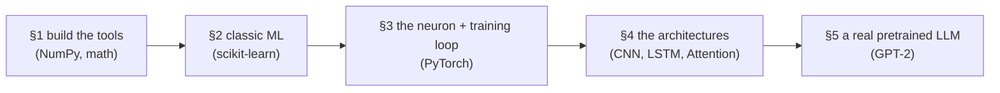

# 🔗 Code Walkthrough: §1 → §5

> **What this guide is:** every `code_examples/*.py` file from sections 1–5, shown in full, with a **"Code ↔ Markdown" map** after each one so you can see exactly which line implements which concept you read about. The runnable `.py` files are in the `original_code/` folder.

**The big picture — the code follows the same ladder as the lessons:**



---

# §1 Foundations

## File: `01_math_basics.py`

```python
import numpy as np

def linear_algebra_examples():
    # Scalars, Vectors, and Matrices
    scalar = 5
    vector = np.array([1, 2, 3])
    matrix = np.array([[1, 2], [3, 4], [5, 6]])

    # Tensors (e.g., 3D tensor like an image with RGB channels)
    tensor = np.random.rand(3, 224, 224)   # 3 channels, 224x224 pixels

    # Matrix Multiplication (the dot product)
    matrix_a = np.array([[1, 2], [3, 4]])
    matrix_b = np.array([[5, 6], [7, 8]])
    dot_product = np.dot(matrix_a, matrix_b)

    # Eigenvalues and Eigenvectors
    square_matrix = np.array([[4, -2], [1, 1]])
    eigenvalues, eigenvectors = np.linalg.eig(square_matrix)

def calculus_examples():
    # Numerical derivative of f(x) = x^2 ; analytical f'(x) = 2x
    def f(x): return x**2
    x_val, h = 3.0, 1e-5
    numerical_derivative = (f(x_val + h) - f(x_val)) / h   # ≈ 6.0
    exact_derivative = 2 * x_val                            # = 6.0

def probability_examples():
    # Normal (Gaussian) distribution
    normal_samples = np.random.normal(loc=0.0, scale=1.0, size=1000)
    # Bernoulli distribution (success/fail) via uniform threshold
    p = 0.7
    bernoulli_samples = (np.random.uniform(0, 1, 1000) < p).astype(int)
```

### 🔗 Code ↔ Markdown (`01_Mathematics.md`)

| Code | Concept in the markdown | Why it matters later |
|------|--------------------------|----------------------|
| `scalar / vector / matrix` and `.shape` | the linear-algebra ladder: scalar → vector → matrix → tensor | every input to a model is one of these |
| `np.random.rand(3, 224, 224)` | a **tensor** (an image = 3 colour channels × H × W) | exactly the shape a CNN eats in §4 |
| `np.dot(a, b)` | **matrix multiplication** | this *is* the `Σ w·x` weighted sum inside every neuron (§3) — the single most-used operation in all of deep learning |
| `np.linalg.eig(...)` | **eigenvalues / eigenvectors** | the mathematical basis of **PCA** (§2) |
| `(f(x+h) - f(x)) / h` | the **derivative** as a slope | the slope *is* the gradient; doing this through a whole network = **backpropagation** (§3) |
| `np.random.normal(...)` | the **Gaussian distribution** | how model weights are randomly initialised before training |
| Bernoulli `(... < p)` | the **Bernoulli (yes/no) distribution** | literally how the synthetic churn labels were sampled in your §2 project |

---

## File: `01_numpy_pandas_basics.py`

```python
import numpy as np, pandas as pd

def numpy_examples():
    arr = np.array([1, 2, 3, 4, 5])
    squared_arr = arr ** 2                  # Vectorization: whole array at once
    matrix = np.array([[1, 2, 3], [4, 5, 6]])
    matrix_plus_10 = matrix + 10            # Broadcasting: scalar applied to all
    np.sum(matrix); np.mean(matrix, axis=0)

def pandas_examples():
    df = pd.DataFrame({'Age':[25,30,35,40,22],
                       'Salary':[50000,60000,75000,90000,45000],
                       'Department':['IT','HR','IT','Finance','HR']})
    df['Salary']                                  # select a column
    df[df['Age'] > 30]                            # filter rows
    df.groupby('Department')['Salary'].mean()     # group + aggregate
    df_missing.loc[2,'Salary'] = np.nan
    df_missing['Salary'].fillna(df_missing['Salary'].mean())  # fill missing
```

### 🔗 Code ↔ Markdown (`02_Programming.md`)

| Code | Concept | Link forward |
|------|---------|--------------|
| `arr ** 2` | **vectorization** — operate on a whole array instantly | why NumPy/PyTorch are fast; loops are too slow for ML |
| `matrix + 10` | **broadcasting** — stretch a small thing across a big one | used constantly when adding a bias to a layer |
| `pd.DataFrame`, `df['col']`, `df[df['Age']>30]` | the **Pandas** data-handling toolkit | the exact operations you ran in the churn notebook |
| `groupby(...).mean()` | aggregation | how you computed "churn rate by contract" |
| `fillna(... .mean())` | **handling missing values** | the data-cleaning step from the churn project (§13 data engineering too) |

---

# §2 Machine Learning

## File: `02_ml_algorithms.py`

```python
from sklearn.model_selection import train_test_split
from sklearn.linear_model import LinearRegression, LogisticRegression
from sklearn.ensemble import RandomForestClassifier
from sklearn.svm import SVC
from sklearn.cluster import KMeans
from sklearn.decomposition import PCA
from sklearn.metrics import accuracy_score, mean_squared_error
from sklearn.datasets import make_classification, make_regression, make_blobs

def linear_regression_example():
    X, y = make_regression(n_samples=100, n_features=1, noise=10, random_state=42)
    X_train, X_test, y_train, y_test = train_test_split(X, y, test_size=0.2, random_state=42)
    model = LinearRegression().fit(X_train, y_train)
    mse = mean_squared_error(y_test, model.predict(X_test))
    model.coef_[0]        # the learned slope  m
    model.intercept_      # the learned bias   b

def classification_examples():
    X, y = make_classification(n_samples=200, n_features=4, n_classes=2, random_state=42)
    X_train, X_test, y_train, y_test = train_test_split(X, y, test_size=0.2, random_state=42)
    LogisticRegression().fit(X_train, y_train)
    RandomForestClassifier(n_estimators=50).fit(X_train, y_train)
    SVC(kernel='linear').fit(X_train, y_train)
    # each scored with accuracy_score(...)

def unsupervised_examples():
    X_blobs, _ = make_blobs(n_samples=150, centers=3, n_features=2)
    KMeans(n_clusters=3, n_init=10).fit(X_blobs)              # .cluster_centers_
    X_high_dim, _ = make_classification(n_samples=100, n_features=10)
    pca = PCA(n_components=2)                                  # 10 dims -> 2
    X_reduced = pca.fit_transform(X_high_dim)
    pca.explained_variance_ratio_                             # variance retained
```

### 🔗 Code ↔ Markdown (`01_Types_of_Learning.md`, `02_Core_Algorithms.md`, `03_Key_Concepts.md`)

| Code | Concept | Which md idea |
|------|---------|---------------|
| `make_regression / make_classification` (with `y`) | **labeled data** | **supervised learning** (§2 file 1) |
| `make_blobs` (no labels used) | **unlabeled data** | **unsupervised learning** |
| `train_test_split(..., test_size=0.2)` | hold out unseen data | **generalization / avoiding overfitting** (§2 file 3) |
| `LinearRegression` → `coef_`, `intercept_` | the line `y = mx + b` | linear regression; `coef_`=m, `intercept_`=b |
| `mean_squared_error` | **MSE loss** | the regression metric / loss |
| `LogisticRegression` | the sigmoid S-curve classifier | the model behind your **spam filter** |
| `RandomForestClassifier(n_estimators=50)` | 50 trees voting | random forest — the **churn** champion |
| `SVC(kernel='linear')` | widest-margin boundary | Support Vector Machine |
| `accuracy_score` | accuracy | remember the **"accuracy trap"** — fine on balanced synthetic data, misleading on imbalanced data |
| `KMeans(n_clusters=3)` → `cluster_centers_` | the centroids | K-means clustering |
| `PCA(n_components=2)` → `explained_variance_ratio_` | squeeze dimensions, keep variance | PCA (built on the eigenvectors from §1) |

---

# §3 Deep Learning

## File: `03_basic_neural_network.py`

```python
import torch, torch.nn as nn, torch.optim as optim

class SimpleFeedForwardNN(nn.Module):
    def __init__(self, input_size, hidden_size, num_classes):
        super().__init__()
        self.layer1 = nn.Linear(input_size, hidden_size)   # Input -> Hidden
        self.activation = nn.GELU()                        # non-linearity
        self.layer2 = nn.Linear(hidden_size, num_classes)  # Hidden -> Output
    def forward(self, x):                                  # the forward pass
        out = self.layer1(x)
        out = self.activation(out)
        out = self.layer2(out)
        return out

def train_dummy_network():
    input_size, hidden_size, num_classes = 10, 32, 2
    learning_rate, batch_size, epochs = 0.001, 16, 5
    model = SimpleFeedForwardNN(input_size, hidden_size, num_classes)

    criterion = nn.CrossEntropyLoss()                      # loss function
    optimizer = optim.AdamW(model.parameters(), lr=learning_rate)

    dummy_inputs  = torch.randn(batch_size, input_size)
    dummy_targets = torch.randint(0, num_classes, (batch_size,))

    for epoch in range(epochs):
        predictions = model(dummy_inputs)        # 1. forward pass
        loss = criterion(predictions, dummy_targets)  # 2. compute loss
        optimizer.zero_grad()                    # 3a. clear old gradients
        loss.backward()                          # 3b. backprop (compute gradients)
        optimizer.step()                         # 3c. update the weights
```

### 🔗 Code ↔ Markdown (`01_Neural_Network_Basics.md`, `02_Loss_Optimizers_LR.md`)

This file is the **clearest mirror** of the markdown — the whole §3 lesson, in code:

| Code | Concept | Markdown link |
|------|---------|---------------|
| `nn.Linear(in, out)` | a layer of neurons computing `z = Wx + b` | the **weighted sum**; `Linear`'s internal weights & biases **are the parameters** |
| `nn.GELU()` | the **activation function** | the activation table — GELU is what **GPT & BERT** use |
| `forward(self, x)` | the **forward pass** | data flowing input → hidden → output |
| `nn.CrossEntropyLoss()` | the **loss function** for classification | the loss table; same loss LLMs use for next-token prediction |
| `optim.AdamW(...)` | the **optimizer** | the optimizer table — AdamW is the LLM standard; its weight-decay = **L2 from §2** |
| `lr=0.001` | the **learning rate** | the "most important knob" |
| `epochs`, `batch_size`, `hidden_size` | **hyperparameters** | §7 hyperparameters too |
| the 4-line loop ↓ | the **training loop** | exactly the loop diagram: predict → loss → backprop → update |
| `optimizer.zero_grad()` | clear last step's gradients | (must reset or they accumulate) |
| `loss.backward()` | **backpropagation** | the chain rule (§1) computing every gradient |
| `optimizer.step()` | take one downhill step | the "ball rolling into the valley" figure |

---

# §4 Neural Network Architectures

## File: `04_cnn_rnn_basics.py`

```python
import torch, torch.nn as nn

class SimpleCNN(nn.Module):                 # input (Batch, Channels, H, W) e.g. (32,1,28,28)
    def __init__(self, num_classes=10):
        super().__init__()
        self.conv1 = nn.Conv2d(1, 16, kernel_size=3, stride=1, padding=1)  # filters
        self.relu  = nn.ReLU()
        self.pool  = nn.MaxPool2d(kernel_size=2, stride=2)                 # downsample
        self.fc    = nn.Linear(16 * 14 * 14, num_classes)                 # final FNN
    def forward(self, x):
        x = self.conv1(x); x = self.relu(x); x = self.pool(x)
        x = torch.flatten(x, 1)             # spatial grid -> 1D vector
        return self.fc(x)

class SimpleLSTM(nn.Module):                # input (Batch, SeqLen, Features) e.g. (32,50,300)
    def __init__(self, input_size=300, hidden_size=128, num_classes=2):
        super().__init__()
        self.lstm = nn.LSTM(input_size, hidden_size, batch_first=True)
        self.fc   = nn.Linear(hidden_size, num_classes)
    def forward(self, x):
        lstm_out, (h_n, c_n) = self.lstm(x) # h_n = final hidden state (the "memory")
        last_hidden_state = h_n[-1]         # use the last step for classification
        return self.fc(last_hidden_state)
```

### 🔗 Code ↔ Markdown (`01_FNN_and_CNN.md`, `02_RNN_LSTM_GRU.md`)

| Code | Concept | Markdown link |
|------|---------|---------------|
| input shape `(32, 1, 28, 28)` | image = batch × channels × H × W | the tensor from §1, now fed to a CNN |
| `nn.Conv2d(kernel_size=3, stride=1, padding=1)` | **filters, stride, padding** | the convolution figure — a 3×3 filter sliding over the image |
| `out_channels=16` | 16 different filters → 16 feature maps | each filter hunts a different pattern |
| `nn.MaxPool2d(2, 2)` | **max pooling** | the pooling figure — halves H & W (28→14) |
| `16 * 14 * 14` | why FC input is that size | the dims after one conv+pool on 28×28 |
| `torch.flatten` → `nn.Linear` | **Flatten → Fully Connected** | the end of the CNN pipeline (`... Flatten → FNN → Output`) |
| `nn.LSTM(..., batch_first=True)` | the recurrent network | the LSTM file |
| input `(32, 50, 300)` | 50-word sentences, 300-dim embeddings | **sequential data** where order matters |
| `h_n` (final hidden state) | the **memory / hidden state** | the conveyor-belt cell state carrying info forward |
| `h_n[-1]` for the prediction | use the accumulated memory at the end | summarizes the whole sequence |

## File: `04_transformer_attention.py`  ⭐ the heart of every LLM

```python
import torch, torch.nn.functional as F, math

def scaled_dot_product_attention(query, key, value, mask=None):
    # Formula: softmax(Q · Kᵀ / √dₖ) · V
    d_k = query.size(-1)
    scores = torch.matmul(query, key.transpose(-2, -1)) / math.sqrt(d_k)   # Q·Kᵀ / √dₖ
    if mask is not None:
        scores = scores.masked_fill(mask == 0, -1e9)   # causal mask: block the future
    attention_weights = F.softmax(scores, dim=-1)       # weights that sum to 1
    output = torch.matmul(attention_weights, value)     # weighted blend of Values
    return output, attention_weights
```

### 🔗 Code ↔ Markdown (`03_Transformers.md`, and §5 `02_Architectures.md`)

This single function is the **exact formula** from the Transformers file — `Attention = softmax(Q·Kᵀ/√d)·V`:

| Code | Concept | Markdown link |
|------|---------|---------------|
| `query, key, value` | **Q / K / V** | the "search engine" analogy: Query looks for, Key advertises, Value carries info |
| `torch.matmul(query, key.transpose(...))` | **Q · Kᵀ** = match scores | how much each word attends to every other — produces a `seq × seq` attention matrix |
| `/ math.sqrt(d_k)` | the **scaling by √dₖ** | keeps softmax stable (stops scores blowing up) |
| `masked_fill(mask == 0, -1e9)` | the **causal mask** | decoder-only "no peeking at the future" → −∞ becomes 0 after softmax |
| `F.softmax(scores)` | **attention weights** | turns scores into probabilities that **sum to 1** (the softmax from §3) |
| `torch.matmul(attention_weights, value)` | weighted sum of **V** | the context-aware output (the "bank" example) |
| `attn_weights[0]` rows sum to 1 | the attention matrix | what you'd visualize as an attention heatmap |

---

# §5 Large Language Models

## File: `05_llm_generation_example.py`

```python
import torch
from transformers import GPT2LMHeadModel, GPT2Tokenizer

def generate_text():
    model_name = "gpt2"
    tokenizer = GPT2Tokenizer.from_pretrained(model_name)     # text <-> token IDs
    model = GPT2LMHeadModel.from_pretrained(model_name)       # pre-trained weights
    model.eval()

    prompt_text = "The future of artificial intelligence is"
    input_ids = tokenizer.encode(prompt_text, return_tensors="pt")   # tokenize

    with torch.no_grad():                       # inference: no gradients
        output_ids = model.generate(
            input_ids,
            max_length=50,            # context budget (prompt + generated)
            no_repeat_ngram_size=2,
            do_sample=True,           # sample from the probability distribution
            temperature=0.7,          # randomness dial
            top_k=50,                 # only consider the 50 likeliest next tokens
            pad_token_id=tokenizer.eos_token_id,
        )
    generated_text = tokenizer.decode(output_ids[0], skip_special_tokens=True)
```

### 🔗 Code ↔ Markdown (`01_Core_Concepts.md`, `02_Architectures.md`, `03_Training_Phases.md`)

This ties **everything** together — it runs a real LLM built from the §4 attention block:

| Code | Concept | Markdown link |
|------|---------|---------------|
| `GPT2Tokenizer` + `tokenizer.encode(...)` | **tokenization** → token IDs | §5 tokens ("1 token ≈ 0.75 words"); §6 BPE |
| `GPT2LMHeadModel` | a **decoder-only** causal LM | the architecture-types figure (GPT family) |
| `.from_pretrained("gpt2")` | loading **pretrained** weights | Phase 1 **Pretraining** — the base model already learned from the internet |
| `model.generate(...)` | the **auto-regressive loop** | **next-token prediction**, one token at a time, fed back in |
| `max_length=50` | the **context window** | the O(N²) limit from core concepts |
| `do_sample=True`, `temperature`, `top_k` | sampling from the **softmax** distribution | softmax over next-token probabilities (§3 & §5); temperature = how "creative" |
| `torch.no_grad()` + `model.eval()` | **inference** mode (no training) | contrast with the §3 training loop |
| `tokenizer.decode(...)` | token IDs → text | the reverse of tokenization |

> Note: this GPT-2 is a **base/pretrained** model, so it just *continues* your prompt — it hasn't had the **SFT + RLHF** phases (§5 file 3) that would turn it into a chat assistant. That's the "base model isn't a chatbot" point, live in code.

---

# 🧠 The one-paragraph synthesis

`math_basics` gives you the matrix-multiply and derivative that **every** later file secretly runs. `ml_algorithms` shows the *classic* way to learn (scikit-learn one-liners). `basic_neural_network` rebuilds learning the *deep* way — a `Linear → GELU → Linear` net trained with the canonical loop (forward → `CrossEntropyLoss` → `backward` → `AdamW.step`). `cnn_rnn_basics` reshapes neurons into the image (CNN) and sequence (LSTM) architectures. `transformer_attention` implements the `softmax(QKᵀ/√d)V` that replaced them. And `llm_generation_example` loads a real GPT-2 made of those attention blocks and generates text token-by-token. **Same ladder as the lessons, rung for rung.**

## ▶️ How to run them
All except the GPT-2 example use only NumPy / scikit-learn / PyTorch. In Colab or locally:
```bash
pip install numpy pandas scikit-learn torch transformers
python original_code/03_basic_neural_network.py
```
The GPT-2 example downloads ~500 MB the first time (`pip install transformers`).
